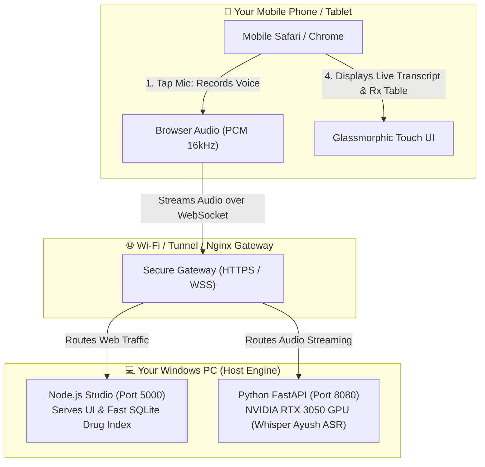

# 📱 Mobile & Multi-Device Deployment Guide
### Running the RxAgent Prescription Studio on Smartphones, Tablets, and Remote Devices

---

## 🧭 Table of Contents
1. [The Big Picture: How This Actually Works](#1-the-big-picture-how-this-actually-works)
2. [The #1 Gotcha: Why Mobile Browsers Block the Microphone](#2-the-1-gotcha-why-mobile-browsers-block-the-microphone)
3. [What is Nginx and Why Do People Use It?](#3-what-is-nginx-and-why-do-people-use-it)
4. [The 3 Ways to Run on Mobile (Pick One)](#4-the-3-ways-to-run-on-mobile-pick-one)
   - [Method 1: The Easiest 2-Minute Solution (Cloudflare Tunnel - Recommended)](#method-1-the-easiest-2-minute-solution-cloudflare-tunnel---recommended)
   - [Method 2: Private Local Wi-Fi with Nginx + SSL](#method-2-private-local-wi-fi-with-nginx--ssl)
   - [Method 3: Quick Android Chrome Developer Flag (No Nginx, No SSL)](#method-3-quick-android-chrome-developer-flag-no-nginx-no-ssl)
5. [Complete Ready-to-Use Nginx Configuration](#5-complete-ready-to-use-nginx-configuration)
6. [Windows Firewall Setup (For Local Network Access)](#6-windows-firewall-setup-for-local-network-access)
7. [Mobile Troubleshooting Cheat Sheet](#7-mobile-troubleshooting-cheat-sheet)

---

## 1. The Big Picture: How This Actually Works

When you want to run this app from your smartphone (iPhone or Android) or a tablet, here is the mental model:



### Key Concept:
- **Your PC is the Brain & Heavy Lifter**: It holds your **NVIDIA GPU**, the **Whisper Ayush AI model**, and the **14,000+ drug relational catalog**.
- **Your Phone is Just a Wireless Microphone & Screen**: Your phone **does not install Python, PyTorch, CUDA, or any app**. It simply opens a browser URL (Safari or Chrome) and streams your voice over Wi-Fi/Internet to your PC.

---

## 2. The #1 Gotcha: Why Mobile Browsers Block the Microphone

If you simply open your phone's browser and type `http://192.168.1.5:5000` (your PC's local IP address), **the microphone will not work**. 

### Why?
Apple (iOS Safari) and Google (Android Chrome) enforce a strict global security policy called **Secure Context**:
> **Browser Security Rule**: Access to the microphone (`navigator.mediaDevices.getUserMedia`) is **permanently blocked on plain `http://` websites**, unless the address is literally `http://localhost`.

Because your phone sees `http://192.168.x.x` (not `localhost`), the mobile browser treats it as an unencrypted, insecure connection and **silently blocks microphone access**.

### The Solution:
To make the microphone work on your phone, the connection between your phone and your PC **must be HTTPS** (encrypted with SSL). This is where **Nginx** or a **Tunnel** comes in.

---

## 3. What is Nginx and Why Do People Use It?

In plain English, **Nginx is a Traffic Cop (Reverse Proxy)**.

Currently on your PC, you have two separate internal ports:
- Port `5000`: The Node.js Web App (the visual website).
- Port `8080`: The Python API (live WebSocket audio transcription).

Without Nginx, your phone would have to talk to two different raw port numbers directly, both over insecure HTTP.

### What Nginx Does:
1. **Puts up a single front door**: It listens on standard port `443` (HTTPS) or port `80` (HTTP).
2. **Handles SSL Encryption (HTTPS)**: Nginx encrypts the traffic so your phone's browser sees a padlock icon (`🔒 https://...`) and happily unlocks the microphone.
3. **Smart Routing**:
   - When your phone asks for the website (`/`), Nginx forwards it to Node.js on port `5000`.
   - When your phone streams live voice audio (`/ws/transcribe`), Nginx forwards it to Python GPU on port `8080`.
4. **Security**: Only Nginx is visible to your local network. Your internal application ports remain protected.

---

## 4. The 3 Ways to Run on Mobile (Pick One)

Depending on your comfort level, choose one of the three methods below:

| Method | Setup Time | Difficulty | Needs Domain/SSL? | Works Outside Home? |
| :--- | :--- | :--- | :--- | :--- |
| **Method 1: Cloudflare Tunnel** *(Recommended)* | **2 minutes** | ⭐ Very Easy | ❌ Handled automatically | ✅ Yes (even on 4G/5G) |
| **Method 2: Nginx + Local SSL (mkcert)** | 10 minutes | ⭐⭐⭐ Moderate | ✅ Self-signed cert | ❌ Wi-Fi only |
| **Method 3: Android Chrome Dev Flag** | 1 minute | ⭐ Easy (Android only) | ❌ None | ❌ Wi-Fi only |

---

### Method 1: The Easiest 2-Minute Solution (Cloudflare Tunnel - Recommended)

This is the fastest, modern way to access your app from an iPhone, Android, or laptop anywhere without touching your router, without buying a domain, and without configuring SSL certificates manually.

Cloudflare provides a free utility called `cloudflared` that creates an instant, secure `https://xxxx.trycloudflare.com` tunnel directly to your local PC.

#### Step 1: Start your app on your PC
Run your standard launcher:
```powershell
.\start_all.bat
```

#### Step 2: Download `cloudflared` (One-time, takes 10 seconds)
Download the single `.exe` file for Windows:
- Direct Download link: [https://github.com/cloudflare/cloudflared/releases/latest/download/cloudflared-windows-amd64.exe](https://github.com/cloudflare/cloudflared/releases/latest/download/cloudflared-windows-amd64.exe)
- Place the file in your project folder as `cloudflared.exe`.

#### Step 3: Run the Tunnel
In a new PowerShell window, run:
```powershell
.\cloudflared.exe tunnel --url http://localhost:5000
```

#### Step 4: Open on Your Phone
In the console output, you will see a temporary URL like:
```text
https://random-words-1234.trycloudflare.com
```
👉 Open this `https://...` link on your iPhone or Android browser.
- The padlock `🔒` is green.
- Tap **Start Voice Dictation** ➡️ The phone asks for Microphone Permission ➡️ Tap **Allow**.
- Speak your prescription. Your phone captures your voice, sends it through Cloudflare to your PC's GPU, and displays the extracted flowsheet on your phone screen in real time!

---

### Method 2: Private Local Wi-Fi with Nginx + SSL

If you are in a clinic or hospital where external internet tunnels are not allowed and you want all audio to stay strictly inside your local Wi-Fi router:

#### Step 1: Find Your PC's Local IP Address
Open PowerShell and run:
```powershell
ipconfig
```
Look for **IPv4 Address** under your active Wi-Fi or Ethernet adapter (e.g. `192.168.1.15`).

#### Step 2: Generate Local SSL Certificates with `mkcert`
Because mobile browsers reject raw self-signed certificates, install `mkcert` (the standard tool for making trusted local certificates):
1. Install via Chocolatey or Scoop:
   ```powershell
   choco install mkcert
   # OR download mkcert.exe from https://github.com/FiloSottile/mkcert/releases
   ```
2. Create certificates for your local IP:
   ```powershell
   mkcert -install
   mkcert 192.168.1.15 localhost 127.0.0.1
   ```
   This generates two files: `192.168.1.15+2.pem` (certificate) and `192.168.1.15+2-key.pem` (private key).

#### Step 3: Download & Install Nginx on Windows
1. Download Nginx for Windows: [https://nginx.org/en/download.html](https://nginx.org/en/download.html) (e.g. `nginx-1.26.x.zip`).
2. Unzip to `C:\nginx`.
3. Copy your `.pem` certificate files to `C:\nginx\conf\ssl\`.

#### Step 4: Configure Nginx
Replace `C:\nginx\conf\nginx.conf` with the configuration provided in [Section 5](#5-complete-ready-to-use-nginx-configuration).

#### Step 5: Start Nginx
In PowerShell:
```powershell
cd C:\nginx
.\nginx.exe
```

#### Step 6: Open on Your Phone
Connect your phone to the **same Wi-Fi network** as your PC.
Open Safari/Chrome and navigate to:
```text
https://192.168.1.15
```
*(On iOS, install the `mkcert` root CA once via Settings so Safari trusts local HTTPS without warnings).*

---

### Method 3: Quick Android Chrome Developer Flag (No Nginx, No SSL)

If you have an **Android phone** running Google Chrome and just want to test voice recording immediately without setting up Nginx or tunnels:

1. Connect phone and PC to the same Wi-Fi network.
2. Find PC IP: run `ipconfig` on your PC (e.g., `192.168.1.15`).
3. Start the app on your PC: `.\start_all.bat`.
4. On your **Android Phone**, open Google Chrome and type:
   ```text
   chrome://flags/#unsafely-treat-insecure-origin-as-secure
   ```
5. In the box, type:
   ```text
   http://192.168.1.15:5000
   ```
6. Change the dropdown from **Disabled** to **Enabled**.
7. Tap the blue **Relaunch** button at the bottom of Chrome.
8. Now visit `http://192.168.1.15:5000` on your Android phone: Chrome will now allow microphone access as if it were a secure localhost!

*(Note: This flag trick only works on Chromium-based browsers like Android Chrome; it does not exist on iPhone Safari).*

---

## 5. Complete Ready-to-Use Nginx Configuration

Save this file as `C:\nginx\conf\nginx.conf` (or `/etc/nginx/sites-available/rxagent` on Linux):

```nginx
worker_processes 1;

events {
    worker_connections 1024;
}

http {
    include       mime.types;
    default_type  application/octet-stream;

    sendfile        on;
    keepalive_timeout 65;

    # Upstream services running on the host machine
    upstream node_frontend {
        server 127.0.0.1:5000;
    }

    upstream python_backend {
        server 127.0.0.1:8080;
    }

    server {
        listen       443 ssl;
        server_name  localhost 192.168.1.15; # <-- Replace with your PC IP

        # SSL Certificates generated by mkcert or Let's Encrypt
        ssl_certificate      conf/ssl/cert.pem;
        ssl_certificate_key  conf/ssl/key.pem;

        ssl_protocols        TLSv1.2 TLSv1.3;
        ssl_ciphers          HIGH:!aNULL:!MD5;

        # 1. Route the Node.js Studio Web Interface
        location / {
            proxy_pass http://node_frontend;
            proxy_http_version 1.1;
            proxy_set_header Host $host;
            proxy_set_header X-Real-IP $remote_addr;
            proxy_set_header X-Forwarded-For $proxy_add_x_forwarded_for;
            proxy_set_header X-Forwarded-Proto https;
        }

        # 2. Route Real-Time WebSocket Audio Streaming to Python Whisper GPU
        location /ws/ {
            proxy_pass http://python_backend/ws/;
            proxy_http_version 1.1;
            proxy_set_header Upgrade $http_upgrade;
            proxy_set_header Connection "Upgrade";
            proxy_set_header Host $host;
            proxy_set_header X-Real-IP $remote_addr;
            proxy_read_timeout 3600s;
            proxy_send_timeout 3600s;
        }

        # 3. Route Python REST API endpoints
        location /api/py/ {
            rewrite ^/api/py/(.*) /api/$1 break;
            proxy_pass http://python_backend;
            proxy_set_header Host $host;
            proxy_set_header X-Real-IP $remote_addr;
        }
    }

    # Redirect plain HTTP (port 80) to secure HTTPS (port 443)
    server {
        listen       80;
        server_name  localhost 192.168.1.15; # <-- Replace with your PC IP
        return 301 https://$host$request_uri;
    }
}
```

---

## 6. Windows Firewall Setup (For Local Network Access)

If you choose **Method 2** or **Method 3**, Windows Defender Firewall will block incoming connections from other devices on your Wi-Fi by default.

To permit traffic from your phone to your PC, open PowerShell as **Administrator** and run:

```powershell
# Allow incoming connections on port 5000 (Node.js App)
netsh advfirewall firewall add rule name="RxAgent Node Web App" dir=in action=allow protocol=TCP localport=5000

# Allow incoming connections on port 8080 (Python GPU API & WebSocket)
netsh advfirewall firewall add rule name="RxAgent Python Backend" dir=in action=allow protocol=TCP localport=8080

# If using Nginx on ports 80/443:
netsh advfirewall firewall add rule name="RxAgent Nginx HTTP" dir=in action=allow protocol=TCP localport=80
netsh advfirewall firewall add rule name="RxAgent Nginx HTTPS" dir=in action=allow protocol=TCP localport=443
```

---

## 7. Mobile Troubleshooting Cheat Sheet

### 🔴 Problem 1: "Microphone button does not do anything, or no permission popup appears."
- **Cause**: You are accessing the site via plain `http://192.168.x.x:5000`. Mobile Safari and Chrome strictly disable microphone hardware on non-HTTPS origins.
- **Fix**: Use **Method 1 (Cloudflare Tunnel)** for instant HTTPS, or set the Android flag in **Method 3**.

---

### 🔴 Problem 2: "The website loads, but live transcription says 'WebSocket connection failed'."
- **Cause**: In Nginx, WebSocket upgrade headers are missing, or your firewall is blocking port `8080`.
- **Fix**: Ensure your Nginx configuration contains:
  ```nginx
  proxy_set_header Upgrade $http_upgrade;
  proxy_set_header Connection "Upgrade";
  ```
  If using Cloudflare Tunnel, ensure the tunnel is routing all paths to port `5000` (the Node server now automatically proxies and coordinates WebSocket URLs).

---

### 🔴 Problem 3: "My phone says 'Server took too long to respond' or 'Site can't be reached'."
- **Cause**: 
  1. Phone and PC are on different Wi-Fi networks (e.g. Phone is on cellular 5G, PC is on Home Wi-Fi).
  2. Windows Firewall is blocking incoming traffic.
- **Fix**: 
  - Switch phone to the same Wi-Fi network as your PC.
  - Or use **Method 1 (Cloudflare Tunnel)**, which bypasses firewalls and works across different networks and mobile data.

---

### 🔴 Problem 4: "Does my phone need a GPU?"
- **Answer**: **No.** 100% of the AI transcription (Whisper Ayush GPU) and prescription parsing runs on your PC. Your phone is simply a display and microphone. Even an older budget phone will run this at full speed with <0.02s flowsheet response times.
