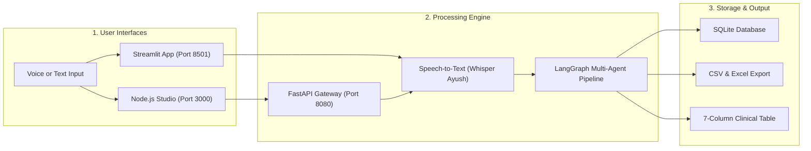
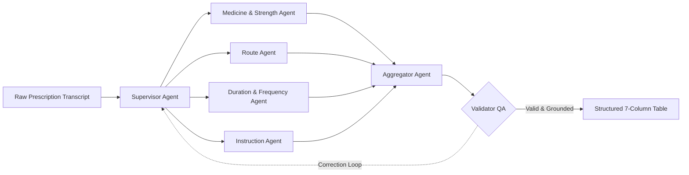

# 🩺 Agentic Prescription Extractor & Studio

[](https://www.python.org/)
[](https://nodejs.org/)
[](https://github.com/langchain-ai/langgraph)
[](LICENSE)

An offline, multi-agent clinical AI system that transcribes doctor-patient voice notes and extracts structured 7-column prescription data with zero hallucinations.

**Author:** **Abhinav Gupta**  
📬 **Email:** [abhinavgupta15.ag@gmail.com](mailto:abhinavgupta15.ag@gmail.com) • 🌐 **GitHub:** [@AbhinavEliac](https://github.com/AbhinavEliac)

---

## 🏗️ System Architecture



---

## 🧠 Multi-Agent Extraction Pipeline



---

## 📊 Structured 7-Column Clinical Schema

| # | Column Name | Description | Example |
| :- | :--- | :--- | :--- |
| **1** | **`Drug_name`** | Drug name with primary active dose | `PHEXIN DT 250 mg`, `Budesonide 200 mcg` |
| **2** | **`strength`** | Secondary dose for combination drugs (or `NONE`) | `37.5 MG`, `NONE` |
| **3** | **`frequency`** | Schedule notation or interval | `twice daily(1-0-1)`, `once daily at bedtime` |
| **4** | **`duration`** | Duration span (supports `till 7 days`, `upto 5 days`) | `7 days`, `10 days`, `2 weeks` |
| **5** | **`route`** | Anatomical route of delivery | `oral`, `inhalation`, `topical`, `nasal`, `ophthalmic` |
| **6** | **`instruction`** | Primary meal rules, device usage, PRN indications | `1. before breakfast`, `1. using Revolizer` |
| **7** | **`additional_instruction`** | Warnings, dosage titrations, follow-up advice | `1. if fever persists increase dose by 20 mg` |

---

## ✨ Key Features

- 🎙️ **Multi-Model STT**: Dynamic toggling across *Whisper Ayush (Fast Turbo + SDPA)*, *NVIDIA Canary 1B*, *NVIDIA Parakeet*, and *Moonshine*.
- 🖥️ **Dual Parallel Interfaces**:
  - **Node.js RxAgent Studio (`http://localhost:3000`)**: Modern glassmorphic web app with live waveform audio recording and inline table editing.
  - **Streamlit Dashboard (`http://localhost:8501`)**: Full multi-tab analytical interface.
- 🧠 **Cross-Sentence Coreference**: Automatically connects pronouns and multi-drug frequency references (*"Both should be taken twice daily after meals"*).
- 🛡️ **Anti-Hallucination QA Loop**: Strict validation loop ensures 100% grounded extraction with zero unsolicited advice.
- 🧹 **Conversational Noise Filter**: Removes greetings, patient complaints, and vitals before table generation.
- 💾 **100% Offline & Private**: Runs locally on CPU/GPU with no cloud dependencies.

---

## 🚀 Quick Start Guide

### 1. Setup Environment
```powershell
git clone https://github.com/AbhinavEliac/Agentic_Prescription_Generator.git
cd Agentic_Prescription_Generator

python -m venv env
.\env\Scripts\Activate.ps1
pip install -r requirements.txt
```

---

### 2. Run Options

#### Option A: Node.js Web App
```powershell
# Terminal 1: Start Python API Gateway (Port 8080)
python -m uvicorn api_server:app --app-dir rx_extractor_app --host 127.0.0.1 --port 8080

# Terminal 2: Start Node.js Studio (Port 3000)
cd rx_node_app
npm install
node server.js
```
👉 Open **[http://localhost:3000](http://localhost:3000)**

#### Option B: Streamlit Dashboard
```powershell
streamlit run rx_extractor_app/app.py
```
👉 Open **[http://localhost:8501](http://localhost:8501)**

---

## 🧪 Automated Verification Suite

Run all 19 automated LangGraph regression tests:
```powershell
python rx_extractor_app/test_langgraph_pipeline.py
```

```text
========================================================
ALL 19 LANGGRAPH DRIFT-PROOF MULTI-AGENT TESTS PASSED!
========================================================
```

---

## 👨‍💻 Author & Contact

**Abhinav Gupta**  
- 📬 **Email:** [abhinavgupta15.ag@gmail.com](mailto:abhinavgupta15.ag@gmail.com)  
- 🌐 **GitHub:** [@AbhinavEliac](https://github.com/AbhinavEliac)  
- 📂 **Repository:** [Agentic_Prescription_Generator](https://github.com/AbhinavEliac/Agentic_Prescription_Generator)

---

## 📄 License
MIT License
