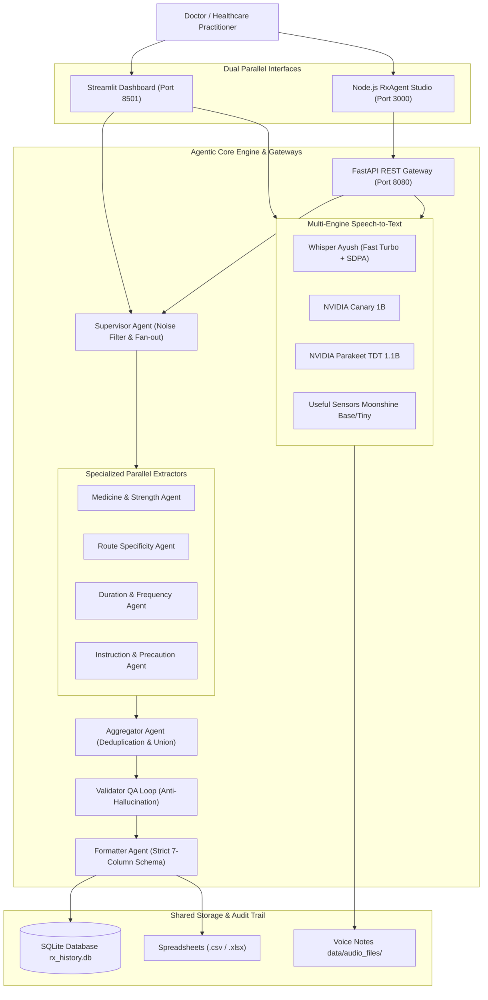

# 🩺 LangGraph Agentic Prescription Extractor & Studio (Offline & Multi-Agent)

A state-of-the-art, 100% **offline agentic medical prescription extraction system** built with **LangGraph**, **LangChain**, multi-engine **Speech-to-Text** (*Whisper Ayush*, *NVIDIA Canary*, *NVIDIA Parakeet*, *Moonshine*), **FAISS Vector Store**, **SQLite**, and dual parallel frontends (**Streamlit Clinical Dashboard** and **Node.js RxAgent Studio**).

The application ingests raw doctor-patient voice recordings or text notes and uses a coordinated network of specialized parallel agents to extract structured clinical prescription blocks into a validated 7-column schema with **zero hallucinations**, **faulty-grammar tolerance**, **conversational noise filtering**, and **no unsolicited commentary**.

---

## 🏗️ Dual-Frontend & Parallel Pipeline Architecture



---

## 📊 Structured 7-Column Clinical Schema

| Column | Description | Real-World Example |
| :--- | :--- | :--- |
| **`Drug_name`** | Brand name or generic name + primary dose | `PHEXIN DT 250 mg`, `Paracetamol 650 mg`, `Ofloxacin-Ornidazole` |
| **`strength`** | Secondary dose value if dual-dosed (or `NONE`) | `20 mg`, `NONE` |
| **`frequency`** | Schedule notation, clinical timing, or interval | `twice daily(1-0-1)`, `every 6 hours`, `TID`, `once daily` |
| **`duration`** | Duration span (supports `till 7 days`, `upto`, `approx`) | `10 days`, `7 days`, `2 weeks`, `30 days` |
| **`route`** | Anatomical route of administration | `oral`, `inhalation`, `topical`, `nasal`, `ophthalmic`, `otic` |
| **`instruction`** | Primary administration timing, meal rules, devices, PRN | `1. before breakfast`, `1. using Revolizer device 2. rinse mouth after use` |
| **`additional_instruction`** | Secondary clinical monitoring, follow-up, warnings, diet/lifestyle | `1. Seek reassessment if eye swelling develops 2. strict maximum of 3 days` |

---

## 🚀 Key Features & Upgrades

1. **Dual Parallel Frontends**:
   - **Node.js RxAgent Studio (`http://localhost:3000`)**: Modern clinical glassmorphism UI with real-time HTML5 Web Audio waveform visualization, live STT/LLM toggling, inline editable 7-column table, 1-click CSV/JSON exports, and history audit trail.
   - **Streamlit Dashboard (`http://localhost:8501`)**: Rich analytical tabs, multi-process management, and SQLite database explorer.
2. **Multi-Model Speech-to-Text Suite**:
   - **Whisper Ayush (Fine-Tuned Turbo Rx v1)**: Optimized with PyTorch Scaled Dot-Product Attention (SDPA), CPU multi-threading, and greedy KV-cached decoding for **3–4x lower latency**.
   - **NVIDIA Canary 1B & Parakeet TDT 1.1B**: High-accuracy multilingual and streaming ASR.
   - **Useful Sensors Moonshine (Base & Tiny)**: Edge/mobile optimized speech recognition.
3. **Cross-Sentence Coreference & Plural Scheduling**:
   - Accurately resolves pronouns and shared references (e.g. *"Both should be taken twice daily after meals"* propagates frequency to all active drugs while guarding anatomical references like *"both eyes"*).
4. **Faulty-Grammar Duration & Titration Parsing**:
   - Robust parsing for informal duration prepositions (`till 7 days`, `upto 5 days`, `for next 2 weeks`) and compound condition-action titrations (`if fever does not go away, increase dosage by 20 mg`).
5. **Conversational Noise-Proofing & Relevance Reasoning**:
   - Strips conversational banter, greetings, patient complaints, and vital signs before table generation.
6. **Quality Assurance Validator Loop**:
   - Anti-hallucination auditor verifies 100% groundedness against raw input text and loops targeted feedback up to a strict cap of 3 iterations.
7. **100% Offline & Private**:
   - Zero external API dependencies or cloud leakage.

---

## 🛠️ How to Run

### 1. Prerequisites
- **Python 3.10+** (Tested on Python 3.10 – 3.13)
- **Node.js 18+** (LTS recommended)
- **Git**

### 2. Setup Virtual Environment
```powershell
# Clone and enter repo
git clone https://github.com/AbhinavEliac/Agentic_Prescription_Generator.git
cd Agentic_Prescription_Generator

# Setup Python dependencies
python -m venv env
.\env\Scripts\Activate.ps1
pip install -r requirements.txt
```

### 3. Option A: Run the Node.js Web Application
```powershell
# Terminal 1: Start the Python Agentic API Gateway (Port 8080)
python -m uvicorn api_server:app --app-dir rx_extractor_app --host 127.0.0.1 --port 8080

# Terminal 2: Start the Node.js Web App (Port 3000)
cd rx_node_app
npm install
node server.js
```
👉 Open browser to: **`http://localhost:3000`**

### 4. Option B: Run the Streamlit Dashboard
```powershell
streamlit run rx_extractor_app/app.py
```
👉 Open browser to: **`http://localhost:8501`**

---

## 🧪 Automated Verification Suite

Run the comprehensive 19-test regression suite covering companion drugs, inhalation routes, topicals, ophthalmic drops, otic drops, interval schedules, speaker headers, cross-sentence coreferences, continuous unpunctuated speech, decimal dosages, faulty grammar durations, and conversational noise filtering:

```powershell
python rx_extractor_app/test_langgraph_pipeline.py
```

```text
========================================================
ALL 19 LANGGRAPH DRIFT-PROOF MULTI-AGENT TESTS PASSED!
========================================================
```
