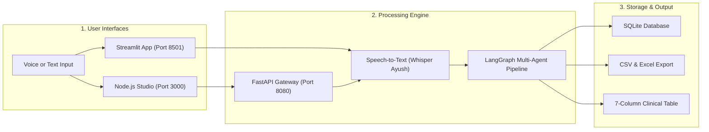
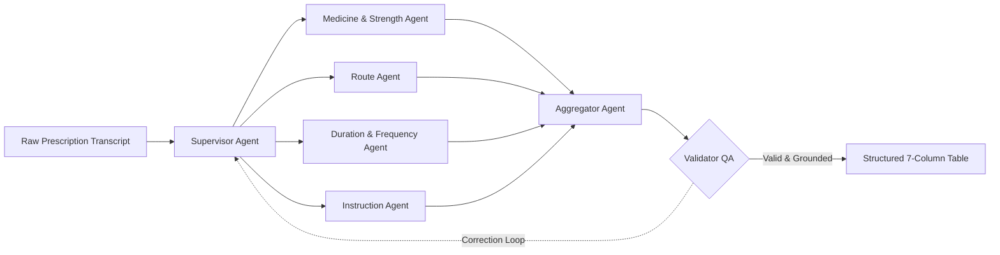

# 🩺 Agentic Prescription Extractor & Studio

[](https://www.python.org/)
[](https://nodejs.org/)
[](https://github.com/langchain-ai/langgraph)
[](LICENSE)

An offline, multi-agent clinical AI system that transcribes doctor-patient voice notes and extracts structured 7-column prescription data with zero hallucinations.

**Author:** **Abhinav Gupta**  
📬 **Email:** [abhinavgupta15.ag@gmail.com](mailto:abhinavgupta15.ag@gmail.com) • 🌐 **GitHub:** [@AbhinavEliac](https://github.com/AbhinavEliac)

---

## 🏗️ System Architecture



---

## 🧠 Multi-Agent Extraction Pipeline



---

## 📊 Structured 7-Column Clinical Schema

| # | Column Name | Description | Example |
| :- | :--- | :--- | :--- |
| **1** | **`Drug_name`** | Drug name with primary active dose | `PHEXIN DT 250 mg`, `Budesonide 200 mcg` |
| **2** | **`strength`** | Secondary dose for combination drugs (or `NONE`) | `37.5 MG`, `NONE` |
| **3** | **`frequency`** | Schedule notation or interval | `twice daily(1-0-1)`, `once daily at bedtime` |
| **4** | **`duration`** | Duration span (supports `till 7 days`, `upto 5 days`) | `7 days`, `10 days`, `2 weeks` |
| **5** | **`route`** | Anatomical route of delivery | `oral`, `inhalation`, `topical`, `nasal`, `ophthalmic` |
| **6** | **`instruction`** | Primary meal rules, device usage, PRN indications | `1. before breakfast`, `1. using Revolizer` |
| **7** | **`additional_instruction`** | Warnings, dosage titrations, follow-up advice | `1. if fever persists increase dose by 20 mg` |

---

## ✨ Key Features

- 🎙️ **Multi-Model STT**: Dynamic toggling across *Whisper Ayush (Fast Turbo + SDPA)*, *NVIDIA Canary 1B*, *NVIDIA Parakeet*, and *Moonshine*.
- 🖥️ **Dual Parallel Interfaces**:
  - **Node.js RxAgent Studio (`http://localhost:3000`)**: Modern glassmorphic web app with live waveform audio recording and inline table editing.
  - **Streamlit Dashboard (`http://localhost:8501`)**: Full multi-tab analytical interface.
- 🧠 **Cross-Sentence Coreference**: Automatically connects pronouns and multi-drug frequency references (*"Both should be taken twice daily after meals"*).
- 🛡️ **Anti-Hallucination QA Loop**: Strict validation loop ensures 100% grounded extraction with zero unsolicited advice.
- 🧹 **Conversational Noise Filter**: Removes greetings, patient complaints, and vitals before table generation.
- 💾 **100% Offline & Private**: Runs locally on CPU/GPU with no cloud dependencies.

---

## 🚀 Detailed Setup & Execution Guide

### 1. Prerequisites
Ensure you have the following installed on your machine:
- **Python**: `3.10` or higher (`3.10`, `3.11`, `3.12`, `3.13` supported)
- **Node.js**: `18.x` or higher (LTS `v20.x` / `v24.x` recommended)
- **Git**: For cloning and branch management

---

### 2. Installation & Environment Setup

Open PowerShell or your terminal:

```powershell
# 1. Clone the repository
git clone https://github.com/AbhinavEliac/Agentic_Prescription_Generator.git
cd Agentic_Prescription_Generator

# 2. Create and activate a Python virtual environment
python -m venv env
.\env\Scripts\Activate.ps1

# 3. Upgrade pip and install all required Python dependencies
pip install --upgrade pip
pip install -r requirements.txt
```

---

### 3. Running the Applications

You can run either the **Modern Node.js Studio App** or the **Streamlit Clinical Dashboard** (or run both concurrently).

#### 🌐 Mode A: Modern Node.js Clinical Studio (Port 3000)

The Node.js setup requires two services running in parallel:
1. The **FastAPI Agentic REST Gateway** (Port `8080`)
2. The **Node.js Express Web App** (Port `3000`)

**Terminal 1: Start the Python API Gateway**
```powershell
# Inside project root with virtual environment activated:
python -m uvicorn api_server:app --app-dir rx_extractor_app --host 127.0.0.1 --port 8080
```
> *This initializes the LangGraph Multi-Agent pipeline and exposes `/api/extract`, `/api/transcribe`, and `/api/history`.*

**Terminal 2: Start the Node.js Web Application**
```powershell
# In a new terminal window:
cd C:\Users\ADMIN\Downloads\rx_extractor_app_agentic\rx_node_app

# Install npm dependencies (only required on first run):
npm install

# Start the Node.js server:
node server.js
# (or: npm start)
```

👉 Open your browser to: **[http://localhost:3000](http://localhost:3000)**

---

#### 📊 Mode B: Streamlit Clinical Dashboard (Port 8501)

If you prefer the native Streamlit analytical dashboard:

```powershell
# From project root with virtual environment activated:
streamlit run rx_extractor_app/app.py
```

👉 Open your browser to: **[http://localhost:8501](http://localhost:8501)**

---

### 📋 Port Mapping Summary

| Service | Port | Local URL | Primary Role |
| :--- | :--- | :--- | :--- |
| **Node.js Studio UI** | `3000` | `http://localhost:3000` | Glassmorphic clinical UI, live waveform voice recording, inline table editing, CSV/JSON exports. |
| **FastAPI REST Gateway** | `8080` | `http://127.0.0.1:8080` | High-speed REST backend serving LangGraph extraction and STT audio transcription. |
| **Streamlit Dashboard** | `8501` | `http://localhost:8501` | Multi-tab clinical portal with process manager, vectorstore inspector, and SQLite database explorer. |

---

### 💡 Common Troubleshooting Tips

1. **`node: The term 'node' is not recognized`**:
   - If you just installed Node.js, your current terminal session hasn't refreshed its environment variables. Run `& "C:\Program Files\nodejs\node.exe" server.js` or close and reopen PowerShell.
2. **`[WinError 10048] Address already in use (Port 8080 / 3000)`**:
   - A background server is already running on that port. Either access the existing app directly in your browser or kill lingering processes using:
     ```powershell
     Get-NetTCPConnection -LocalPort 8080, 3000 -ErrorAction SilentlyContinue | ForEach-Object { Stop-Process -Id $_.OwningProcess -Force }
     ```

---

## 🧪 Automated Verification Suite

Run all 19 automated LangGraph regression tests:
```powershell
python rx_extractor_app/test_langgraph_pipeline.py
```

```text
========================================================
ALL 19 LANGGRAPH DRIFT-PROOF MULTI-AGENT TESTS PASSED!
========================================================
```

---

## 👨‍💻 Author & Contact

**Abhinav Gupta**  
- 📬 **Email:** [abhinavgupta15.ag@gmail.com](mailto:abhinavgupta15.ag@gmail.com)  
- 🌐 **GitHub:** [@AbhinavEliac](https://github.com/AbhinavEliac)  
- 📂 **Repository:** [Agentic_Prescription_Generator](https://github.com/AbhinavEliac/Agentic_Prescription_Generator)

---

## 📄 License
MIT License
