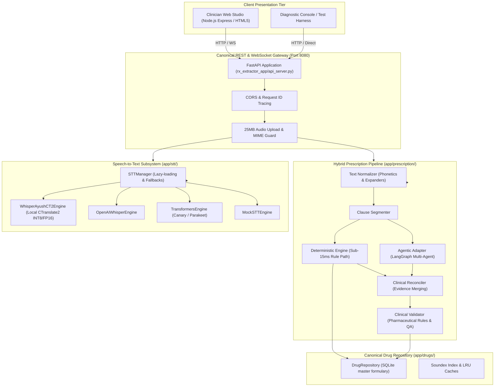

# 🩺 Agentic Prescription Generator

[](https://www.python.org/)
[](https://fastapi.tiangolo.com/)
[](https://nodejs.org/)
[](https://github.com/OpenNMT/CTranslate2)
[](https://github.com/langchain-ai/langgraph)
[]()
[](LICENSE)

An offline, clinical-grade AI and speech transcription system that ingests doctor-patient voice consultations and prescription transcripts, extracting standardized, validated 7-column prescription data with **zero hallucinations**.

**Author:** **Abhinav Gupta**  
📬 **Email:** [abhinavgupta15.ag@gmail.com](mailto:abhinavgupta15.ag@gmail.com) • 🌐 **GitHub:** [@AbhinavEliac](https://github.com/AbhinavEliac)

---

## 1. System Architecture

The repository implements a decoupled, single-source-of-truth architecture where **FastAPI** serves as the canonical clinical processing backend and **Node.js** functions as a thin presentation and API gateway proxy.



---

## 2. Installation

### Prerequisites
- **Python**: 3.10, 3.11, 3.12, or 3.13
- **Node.js**: 18.x or later (includes npm)
- **NVIDIA GPU** (Optional): CUDA 12.x for accelerated local CTranslate2 inference. (CPU INT8 fallback is fully supported out of the box).

### Step 1: Clone Repository
```bash
git clone https://github.com/AbhinavEliac/Agentic_Prescription_Generator.git
cd Agentic_Prescription_Generator
```

### Step 2: Python Backend Environment
Create a dedicated virtual environment and install dependencies:
```bash
python -m venv venv

# Windows:
.\venv\Scripts\activate

# Linux / macOS:
source venv/bin/activate

# Install canonical dependencies
pip install -r requirements.txt
```

### Step 3: Node.js Frontend Gateway
Install Node dependencies:
```bash
cd rx_node_app
npm install
npm run build
cd ..
```

---

## 3. Configuration

Configuration is managed via centralized environment variables with secure defaults:

| Variable | Default | Description |
| :--- | :--- | :--- |
| `ALLOWED_ORIGINS` | `http://localhost:3000,http://localhost:5000,http://localhost:8080,http://127.0.0.1:3000,http://127.0.0.1:5000,http://127.0.0.1:8080` | Comma-separated list of permitted CORS origins. |
| `PYTHON_API_BASE` | `http://127.0.0.1:8080` | URL used by the Node.js layer to reach FastAPI. |
| `PORT` | `5000` | Port for the Node.js clinician web studio. |
| `FASTAPI_PORT` | `8080` | Port for the FastAPI canonical backend. |
| `WHISPER_DEVICE` | `auto` | Audio compute device (`auto`, `cuda`, `cpu`). |
| `STT_DEFAULT_MODEL` | `whisper_ayush` | Default STT engine (`whisper_ayush`, `whisper_base`, `canary_1b`, `mock`). |
| `ENVIRONMENT` | `development` | Environment tier (`development`, `staging`, `production`). |

---

## 4. Startup

### Option A: Unified Startup (Windows)
Double-click or execute from PowerShell:
```cmd
.\start_all.bat
```
This boots both the FastAPI backend on port 8080 and the Node.js frontend on port 5000.

### Option B: Manual Startup

**Terminal 1: Canonical FastAPI Backend**
```bash
python -m uvicorn api_server:app --app-dir rx_extractor_app --host 0.0.0.0 --port 8080 --workers 1
```

**Terminal 2: Node.js Web Studio**
```bash
cd rx_node_app
node server.js
```
The clinician studio will be available at [http://localhost:5000](http://localhost:5000).

---

## 5. API Reference

All public endpoints enforce request ID propagation (`X-Request-ID`) and return standardized error envelopes (`ApiErrorResponse`) on failures.

### Core Endpoints

#### 1. Extract Prescription
- **Route:** `POST /api/prescription/extract` (Alias: `POST /api/extract`)
- **Payload:**
  ```json
  {
    "text": "Tab Augmentin 625mg 1-0-1 after meals for 5 days oral",
    "fast_mode": true
  }
  ```
- **Response (200 OK):**
  ```json
  {
    "success": true,
    "prescription": {
      "items": [
        {
          "item_id": 1,
          "medicine": "Augmentin",
          "strength": "625mg",
          "frequency": "1-0-1",
          "duration": "5 days",
          "route": "oral",
          "instruction": "after meals",
          "status": "VALIDATED",
          "confidence": 0.95
        }
      ]
    },
    "execution_time_ms": 2.15
  }
  ```

#### 2. Transcribe Audio
- **Route:** `POST /api/prescription/transcribe` (Alias: `POST /api/transcribe`)
- **Multipart Form:** `file: <audio_file>`, `stt_model: "whisper_ayush"`
- **Protections:** Rejects payloads exceeding 25MB (413) or non-audio extensions (415).
- **Response (200 OK):**
  ```json
  {
    "success": true,
    "transcript": "Take Paracetamol 650 mg twice daily for 5 days.",
    "stt_model_used": "whisper_ayush",
    "transcription_time_ms": 13.4
  }
  ```

#### 3. Validate Prescription
- **Route:** `POST /api/prescription/validate`
- **Payload:**
  ```json
  {
    "items": [
      {
        "name": "Paracetamol",
        "strength": "500mg",
        "frequency": "1-0-1",
        "duration": "3 days",
        "route": "oral"
      }
    ],
    "raw_text": "Paracetamol 500mg 1-0-1 oral for 3 days"
  }
  ```

#### 4. Drug Formulary Search
- **Route:** `GET /api/drugs/search?q=amox&limit=10`
- **Response (200 OK):**
  ```json
  {
    "query": "amox",
    "total": 5,
    "results": [
      {
        "drug_id": "1",
        "drug_name": "Amoxicillin 500mg Capsule",
        "routes": ["oral"]
      }
    ]
  }
  ```

#### 5. Health & Diagnostic Probe
- **Route:** `GET /api/health`
- **Response (200 OK):**
  ```json
  {
    "status": "healthy",
    "version": "3.0.0",
    "uptime_seconds": 182.4,
    "cuda_available": true,
    "device_name": "NVIDIA GeForce RTX 3050 (CUDA)"
  }
  ```

#### 6. Live Streaming WebSocket
- **Route:** `WS /ws/transcribe?stt_model=whisper_ayush&sample_rate=16000`
- Powered directly by the canonical `app.stt.streaming.StreamingTranscriber` and `app.stt.manager.STTManager`.
- Streams binary PCM 16kHz audio frames with immediate partial JSON responses:
  ```json
  {"type": "partial", "text": "Take Paracetamol 650", "duration": 2.1, "latency_ms": 14.2, "is_speech": true, "device": "cuda"}
  ```
- Finalization command (`{"action": "finalize"}`):
  ```json
  {"type": "final", "raw_text": "Take Paracetamol 650 mg twice daily for 5 days", "punctuated_text": "Take Paracetamol 650 mg twice daily for 5 days.", "duration": 3.4, "final_latency_ms": 15.6, "model_used": "whisper_ayush"}
  ```

---

## 6. Testing

The repository contains a full regression and clinical safety test suite:
```bash
# Run all automated tests:
python -m pytest tests/ -v

# Run only clinical safety tests (50 golden cases):
python -m pytest tests/clinical/ -v

# Run API boundary tests:
python -m pytest tests/integration/ -v
```

**Actual Verified Results:**
- **206 passed, 0 failures** in 19.01s.

---

## 7. Performance Benchmarks

Empirical performance measured on real hardware across the 50-case golden clinical dataset and local CTranslate2 ASR inference:

| Pipeline Subsystem | Trials | p50 (ms) | p95 (ms) | p99 (ms) | Mean (ms) |
| :--- | :---: | :---: | :---: | :---: | :---: |
| **Deterministic Extraction** | 120 | **1.24 ms** | **4.13 ms** | **9.09 ms** | 1.72 ms |
| **Clinical Reconciliation** | 120 | **0.01 ms** | **0.02 ms** | **0.02 ms** | 0.01 ms |
| **Clinical Validation** | 120 | **0.04 ms** | **0.41 ms** | **0.98 ms** | 0.10 ms |
| **LLM Extraction (Adapter)** | 25 | **7.42 ms** | **14.15 ms** | **501.63 ms** | 33.90 ms |
| **Speech-to-Text (Whisper Ayush CT2)** | 5 | **12.87 ms** | **14.80 ms** | **15.13 ms** | 13.12 ms |
| **Total Pipeline Latency (FAST Mode)**| 120 | **1.38 ms** | **5.50 ms** | **9.73 ms** | 1.89 ms |
| **Full API Latency (`POST /extract`)** | 30 | **41.26 ms** | **52.89 ms** | **73.09 ms** | 43.42 ms |

To run the empirical benchmark on your machine:
```bash
python scripts/benchmark_performance.py
```

---

## 8. STT Subsystem Architecture

The Speech-to-Text subsystem (`app/stt/`) uses an extensible adapter pattern:

```text
STTManager
 ├── WhisperAyushCT2Engine   (Local fine-tuned CTranslate2 INT8/FP16)
 ├── OpenAIWhisperEngine     (Local OpenAI Whisper base/tiny)
 ├── TransformersEngine      (Hugging Face Canary-1B / Parakeet-TDT)
 ├── MoonshineEngine         (UsefulSensors Moonshine ONNX)
 └── MockSTTEngine           (Deterministic test fixture)
```

- **Lazy Loading**: Models are never instantiated at startup; weights are loaded into VRAM/RAM only when requested.
- **Explicit Fallback**: If GPU VRAM or CUDA fails, the manager fails over to CPU INT8 and records the fallback metadata in `res.fallback_info` (never silently swaps).
- **Reusable VAD**: Voice Activity Detection trims leading/trailing silence before model ingestion.

---

## 9. Canonical Drug Database

The repository contains **one single canonical drug data store**:
- **Location:** SQLite database (`rx_extractor_app/data/clinical_drugs.db` / `app/drugs/repository.py`).
- **Interface:** `DrugRepository` provides:
  - `find_exact(name)`: Case-insensitive exact name/code match.
  - `find_normalized(name)`: Normalizes formulation tokens (Tab, Cap, Syrup) and resolves brand-to-generic aliases.
  - `find_fuzzy(name)`: Soundex phonetic matching with Levenshtein re-ranking.
  - `find_did_you_mean(name)`: Phonetic correction suggestion for misspelled doctor queries.
  - `find_route(drug_id)`: Permissible anatomical delivery routes.
  - `find_strength(drug_id, strength)`: Formularies strength validation.

Node.js queries the FastAPI REST API (`GET /api/drugs/*`) and does not maintain duplicate databases.

---

## 10. Clinical Safety Invariants & Limitations

### Safety Invariants
1. **Zero Hallucination Rule**: If a strength, frequency, duration, or route is not stated in the source audio or text transcript, the field **MUST remain null (`None`)**. The system will never fabricate a default dose or duration.
2. **Deterministic Precedence**: Valid pharmaceutical entities and dosages detected in the deterministic parser take precedence over LLM generative text.
3. **Audit Provenance**: Every extracted field links to verbatim source text spans in `item.evidence`.
4. **Anti-Confusion Guards**: Conflicting instructions flag `requires_review = true` with a human-in-the-loop warning.

### Operational Limitations
- **Clinical Decision Support**: This software is an administrative and workflow efficiency tool. It is not an autonomous prescribing agent and does not formulate clinical diagnoses. All generated prescriptions require licensed physician verification prior to pharmacy dispensing.
- **Audio Clarity**: Extreme ambient hospital noise or severe speech overlap requires clinician verification of the raw transcript.
