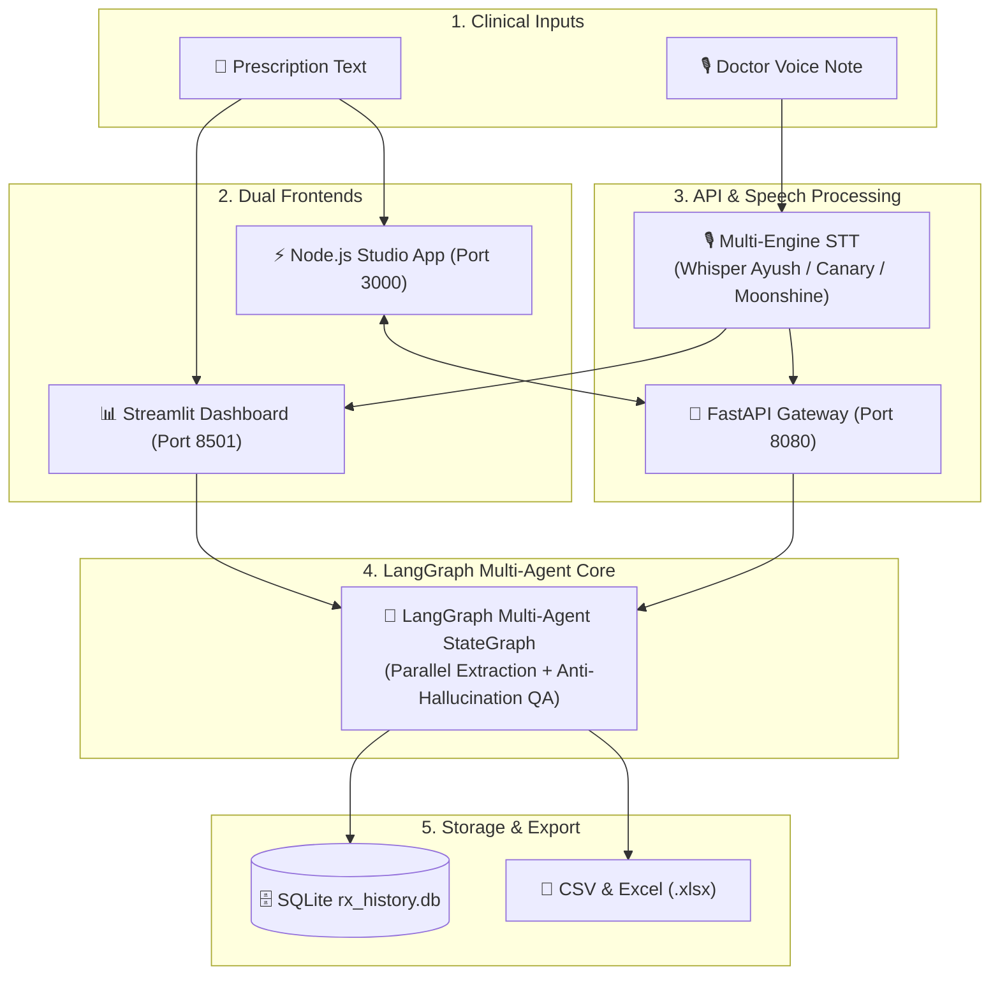
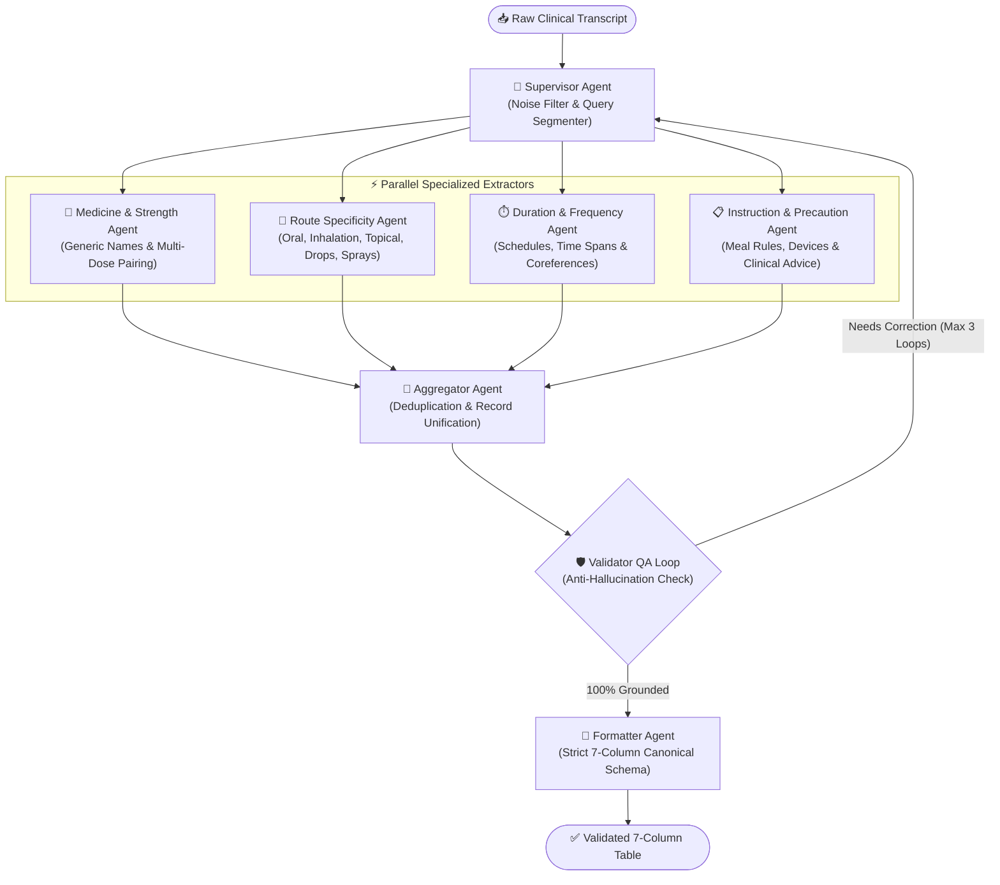

# 🩺 LangGraph Agentic Prescription Extractor & Studio

<div align="center">

[](https://www.python.org/)
[](https://nodejs.org/)
[](https://github.com/langchain-ai/langgraph)
[](#-how-to-run)
[](#-license)

**A 100% Offline, Privacy-Preserving Clinical AI System for Doctor Voice-to-Rx Transcription, Multi-Agent Field Extraction, and Verified Spreadsheet Export.**

Developed with ❤️ by **Abhinav Gupta** • ✉️ [abhinavgupta15.ag@gmail.com](mailto:abhinavgupta15.ag@gmail.com)

</div>

---

## 🌟 Executive Summary

**LangGraph Agentic Prescription Extractor** is a clinical-grade AI intelligence system engineered to eliminate clinical documentation burden. It transforms unpunctuated doctor-patient voice recordings and complex multi-drug text instructions into verified, structured 7-column clinical tables.

Built on an anti-hallucination **LangGraph Multi-Agent Architecture**, the engine executes specialized parallel extractors coordinated by a central supervisor, verified by a strict validator loop, and rendered across **dual parallel user interfaces** (Streamlit Dashboard & Node.js Clinical Studio).

---

## 🏗️ 1. End-to-End System Architecture



---

## 🧠 2. LangGraph Multi-Agent Extraction Pipeline



---

## 📊 Structured 7-Column Clinical Schema

| # | Column Name | Description | Clinical Example |
| :- | :--- | :--- | :--- |
| **1** | **`Drug_name`** | Brand name or generic compound with primary dose | `PHEXIN DT 250 mg`, `Paracetamol 650 mg`, `Budesonide 200 mcg` |
| **2** | **`strength`** | Secondary dose strength if multi-ingredient compound (or `NONE`) | `37.5 MG`, `10 mg`, `NONE` |
| **3** | **`frequency`** | Dosage frequency notation, clinical interval, or timing schedule | `twice daily(1-0-1)`, `every 6 hours`, `TID`, `once daily at bedtime` |
| **4** | **`duration`** | Duration span (supports `till 7 days`, `upto 5 days`, `for 2 weeks`) | `7 days`, `10 days`, `2 weeks`, `30 days` |
| **5** | **`route`** | Verified anatomical route of administration | `oral`, `inhalation`, `topical`, `nasal`, `ophthalmic`, `otic` |
| **6** | **`instruction`** | Primary administration instructions (meal rules, devices, PRN) | `1. before breakfast`, `1. using Revolizer 2. rinse mouth after use` |
| **7** | **`additional_instruction`** | Secondary clinical guidance (follow-up, warnings, titrations, lifestyle) | `1. Seek reassessment if eye swelling develops 2. strict max of 3 days` |

---

## ✨ Key Capabilities & Highlights

- 🎙️ **Multi-Model Speech-to-Text Suite**:
  - **Whisper Ayush (Fine-Tuned Turbo Rx v1)**: Accelerated via PyTorch Scaled Dot-Product Attention (SDPA), multi-threaded CPU parallelization, and greedy KV-cached decoding (**3–4x lower latency**).
  - Dynamic toggling across **NVIDIA Canary 1B**, **NVIDIA Parakeet TDT 1.1B**, and **Useful Sensors Moonshine (Base/Tiny)**.
- ⚡ **Dual Parallel Frontends**:
  - **Node.js RxAgent Studio (`http://localhost:3000`)**: Glassmorphism UI, HTML5 Web Audio live waveform visualizer, inline editable 7-column table, 1-click CSV/JSON export, and real-time history audit sync.
  - **Streamlit Clinical Dashboard (`http://localhost:8501`)**: Full multi-tab analytical interface, vector store prompt inspection, and SQLite process manager.
- 🧠 **Cross-Sentence Coreference & Plural Broadcaster**:
  - Resolves pronouns and shared references (*"Both should be taken twice daily after meals"* propagates frequency to all active drugs while safeguarding anatomical references like *"both eyes"*).
- 🛡️ **Anti-Hallucination & Doctor-Grounded**:
  - Strict validator loop guarantees zero unsolicited advice, zero moralizing, and zero speculative commentary.
- 🧹 **Conversational Chatter & Noise-Proofing**:
  - Automatically isolates clinical prescriptions from conversational chatter (*"Good morning doctor"*, *"I have fever since yesterday"*, *"BP is 130/80 mmHg"*).
- 💾 **100% Offline & Private**:
  - Zero external API dependencies, cloud transmission, or third-party data leakage.

---

## 🚀 How to Run

### 1. Prerequisites
- **Python 3.10+** (Tested on Python 3.10, 3.11, 3.12, 3.13)
- **Node.js 18+** (LTS recommended)
- **Git**

### 2. Installation
```powershell
# Clone the repository
git clone https://github.com/AbhinavEliac/Agentic_Prescription_Generator.git
cd Agentic_Prescription_Generator

# Setup Python virtual environment
python -m venv env
.\env\Scripts\Activate.ps1

# Install Python requirements
pip install -r requirements.txt
```

---

### 3. Running the Applications

#### 🌐 Option A: Run the Modern Node.js Web Application
```powershell
# Terminal 1: Start the Python Agentic API Gateway (Port 8080)
python -m uvicorn api_server:app --app-dir rx_extractor_app --host 127.0.0.1 --port 8080

# Terminal 2: Start the Node.js Studio App (Port 3000)
cd rx_node_app
npm install
node server.js
```
👉 Open browser: **[http://localhost:3000](http://localhost:3000)**

#### 📊 Option B: Run the Streamlit Dashboard
```powershell
streamlit run rx_extractor_app/app.py
```
👉 Open browser: **[http://localhost:8501](http://localhost:8501)**

---

## 🧪 Automated Verification Suite (19/19 Passing)

Run the comprehensive end-to-end regression test suite covering all multi-drug, coreference, dosage titration, topical, inhalation, and continuous speech edge cases:

```powershell
python rx_extractor_app/test_langgraph_pipeline.py
```

```text
========================================================
ALL 19 LANGGRAPH DRIFT-PROOF MULTI-AGENT TESTS PASSED!
========================================================
```

---

## 👨‍💻 Author & Contact

**Abhinav Gupta**  
- ✉️ Email: [abhinavgupta15.ag@gmail.com](mailto:abhinavgupta15.ag@gmail.com)  
- 🐙 GitHub: [@AbhinavEliac](https://github.com/AbhinavEliac)  
- 📂 Repository: [Agentic_Prescription_Generator](https://github.com/AbhinavEliac/Agentic_Prescription_Generator)

---

## 📄 License

This project is licensed under the **MIT License**.
