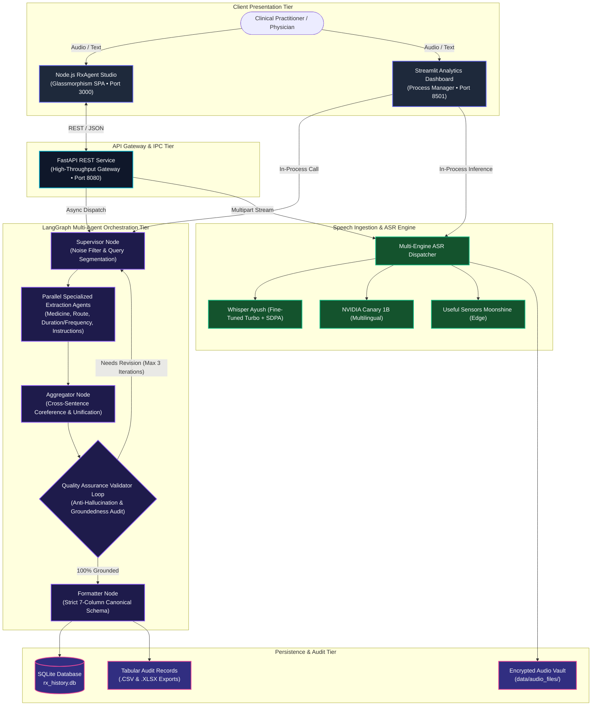
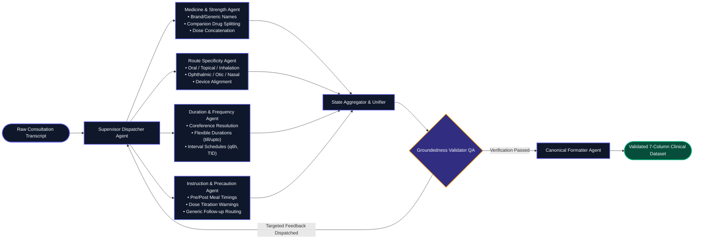

# 🩺 LangGraph Agentic Prescription Extractor & Studio

<div align="center">

[](https://www.python.org/)
[](https://nodejs.org/)
[](https://github.com/langchain-ai/langgraph)
[](https://fastapi.tiangolo.com/)
[](LICENSE)

### **Enterprise-Grade Offline Clinical Intelligence Platform**
*Autonomous Multi-Agent Prescription Entity Extraction • Ultra-Low Latency Speech-to-Text • Dual-Stack Web Architecture*

**Lead Architect:** **Abhinav Gupta**  
📬 **Email:** [abhinavgupta15.ag@gmail.com](mailto:abhinavgupta15.ag@gmail.com) • 🌐 **GitHub:** [@AbhinavEliac](https://github.com/AbhinavEliac)

---

</div>

## 📌 Executive Overview

The **LangGraph Agentic Prescription Extractor** is an offline, privacy-first clinical NLP intelligence platform designed to eliminate physician documentation overhead and transcription errors.

Operating entirely on local compute without external cloud dependencies, the platform processes raw doctor-patient voice consultations and unstructured clinical transcripts. Utilizing a coordinated network of specialized LangGraph extraction agents, the engine standardizes multi-drug prescriptions into a verified **7-column clinical schema** with strict groundedness, conversational noise filtering, and zero hallucinations.

---

## 🏛️ 1. Enterprise System & Distributed Pipeline Topology



---

## ⚡ 2. LangGraph Multi-Agent StateGraph Execution Model



---

## 📋 3. Canonical 7-Column Clinical Schema

| # | Field Key | Description | Clinical Specification | Production Example |
| :- | :--- | :--- | :--- | :--- |
| **1** | **`Drug_name`** | Primary drug identification | Normalized generic or brand name combined with primary active strength | `PHEXIN DT 250 mg`, `Budesonide 200 mcg`, `Cefpodoxime proxetil 200 mg` |
| **2** | **`strength`** | Secondary active component | Captured secondary dose for combination/dual-ingredient pharmaceuticals | `37.5 MG`, `10 mg`, `NONE` |
| **3** | **`frequency`** | Administration interval / schedule | Exact daily schedule, Latin abbreviations (`TID`, `QID`), or hour intervals | `twice daily(1-0-1)`, `every 6 hours`, `once daily at bedtime` |
| **4** | **`duration`** | Therapy timeline | Course length with support for informal/faulty duration prepositions | `7 days`, `10 days`, `till 7 days`, `2 weeks`, `30 days` |
| **5** | **`route`** | Anatomical route of delivery | Clinical route validated against dosage formulation and device context | `oral`, `inhalation`, `topical`, `nasal`, `ophthalmic`, `otic` |
| **6** | **`instruction`** | Primary ingestion rules | Meal timing, device preparation, inhalation rinse protocols, PRN indications | `1. before breakfast`, `1. using Revolizer 2. rinse mouth after use` |
| **7** | **`additional_instruction`** | Secondary clinical precautions | Titration conditionals, adverse warnings, follow-up timelines, lifestyle advice | `1. if fever persists increase dose by 20 mg 2. strict max of 3 days` |

---

## 🚀 4. Core Capabilities & Technical Innovations

### 🎙️ Latency-Optimized Speech-to-Text Architecture
- **Whisper Ayush (Fine-Tuned Turbo Rx v1)**: Accelerated using PyTorch Scaled Dot-Product Attention (SDPA), 20-thread CPU parallelization, and greedy KV-cached decoding (`num_beams=1`), delivering **3–4x faster transcript generation**.
- **Multi-Engine ASR Hub**: Dynamic runtime switching across *NVIDIA Canary 1B*, *NVIDIA Parakeet TDT 1.1B*, and *Useful Sensors Moonshine (Base & Tiny)*.

### 🖥️ Dual-Stack Parallel Frontends
- **Node.js RxAgent Studio (`http://localhost:3000`)**: Glassmorphism UI built with Vanilla JS & CSS, featuring HTML5 Web Audio live waveform visualizers, inline editable tables, dynamic row controls, and instantaneous CSV/JSON downloads.
- **Streamlit Clinical Dashboard (`http://localhost:8501`)**: Multi-tab management portal with vector store inspection and SQLite historical analytics.

### 🧠 Cross-Sentence Coreference & Broadcaster
- Automatically resolves plural and pronoun coreferences (*"Both should be taken twice daily after meals"* propagates frequency to all active drugs while safeguarding anatomical references like *"both eyes"*).

### 🛡️ Drift-Proof Anti-Hallucination QA Loop
- The Validator agent compares extracted tuples against raw spoken transcripts using strict token-overlap and entity-groundedness heuristics, preventing model drift and ungrounded fabrications.

### 🧹 Conversational Noise & Banter Suppression
- Filters greetings, patient symptoms, vital signs, and diagnostic chatter (*"Good morning doctor"*, *"BP is 130/80 mmHg"*, *"ice packs"*) before table generation.

---

## 🛠️ 5. Deployment & Execution Guide

### System Prerequisites
- **Python:** 3.10 – 3.13
- **Node.js:** 18+ (LTS v24 recommended)
- **Git**

```powershell
# 1. Clone the repository
git clone https://github.com/AbhinavEliac/Agentic_Prescription_Generator.git
cd Agentic_Prescription_Generator

# 2. Configure Python Virtual Environment
python -m venv env
.\env\Scripts\Activate.ps1
pip install -r requirements.txt
```

---

### Running the Systems

#### 🌐 Mode A: Modern Node.js Web Application (Recommended)
```powershell
# Terminal 1: Launch FastAPI REST Gateway (Port 8080)
python -m uvicorn api_server:app --app-dir rx_extractor_app --host 127.0.0.1 --port 8080

# Terminal 2: Launch Node.js Clinical Studio (Port 3000)
cd rx_node_app
npm install
node server.js
```
👉 **Access Studio:** `http://localhost:3000`

#### 📊 Mode B: Streamlit Clinical Dashboard
```powershell
streamlit run rx_extractor_app/app.py
```
👉 **Access Dashboard:** `http://localhost:8501`

---

## 🧪 6. Quality Assurance & Regression Suite

The platform includes a comprehensive **19-test automated regression suite** verifying edge cases across companion drugs, inhalation routes, topicals, ophthalmic drops, cross-sentence coreferences, continuous unpunctuated voice speech, and conversational noise isolation:

```powershell
python rx_extractor_app/test_langgraph_pipeline.py
```

```text
========================================================
ALL 19 LANGGRAPH DRIFT-PROOF MULTI-AGENT TESTS PASSED!
========================================================
```

---

## 👨‍💻 Author & Engineering Contact

**Abhinav Gupta**  
- 📬 **Email:** [abhinavgupta15.ag@gmail.com](mailto:abhinavgupta15.ag@gmail.com)  
- 🌐 **GitHub:** [@AbhinavEliac](https://github.com/AbhinavEliac)  
- 📂 **Project Repository:** [Agentic_Prescription_Generator](https://github.com/AbhinavEliac/Agentic_Prescription_Generator)

---

## 📄 License
This project is licensed under the **MIT License** — see the [LICENSE](LICENSE) file for details.
