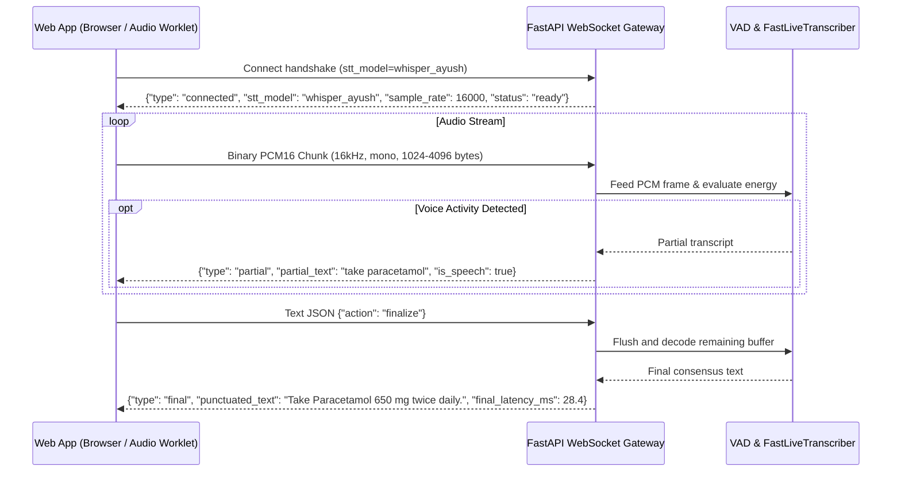

# Canonical API Contract Specification: Agentic Prescription Generator

**Version**: 3.0.0  
**Date**: September 8, 2026  
**Implementation**: [`app/api/schemas.py`](file:///c:/Users/ADMIN/Downloads/rx_extractor_app_agentic/app/api/schemas.py) & [`rx_extractor_app/api_server.py`](file:///c:/Users/ADMIN/Downloads/rx_extractor_app_agentic/rx_extractor_app/api_server.py)  
**Backend Port**: `http://127.0.0.1:8080` (FastAPI Canonical Clinical Gateway)  
**Frontend Port**: `http://127.0.0.1:5000` (Node.js Presentation & Proxy Layer)  
**Dev Console Port**: `http://127.0.0.1:8501` (Streamlit Developer / Benchmark Console)  
**Status**: Canonical Standard  

---

## 1. Architectural Principles

1. **FastAPI Canonical Clinical Backend**: All clinical interpretation, deterministic extraction, NLP/LLM reconciliation, clinical validation, formulary search, and STT inference are authored and executed exclusively within Python FastAPI.
2. **Node.js Thin Presentation Layer**: The Node.js application (`rx_node_app`) contains **zero** clinical regex logic, **zero** independent drug databases, and **zero** heuristic prescription parsing. It acts strictly as an express/static server and transparent proxy forwarder to FastAPI.
3. **End-to-End Tracing (`X-Request-ID`)**: Every incoming request accepts or is assigned a unique UUID `X-Request-ID`. This header is passed through the Node proxy, evaluated in the FastAPI request middleware, and returned in both the HTTP response headers and JSON body payloads.
4. **Strict Schema Contracts**: All payloads adhere to Pydantic v2 schemas defined in [`app/api/schemas.py`](file:///c:/Users/ADMIN/Downloads/rx_extractor_app_agentic/app/api/schemas.py).
5. **Standardized Error Envelopes**: All client errors (`400`, `422`) and server errors (`500`, `503`) return a uniform `ApiErrorResponse` JSON body.

---

## 2. Global Headers & Tracing

| Header | Direction | Type | Description |
| :--- | :--- | :--- | :--- |
| `X-Request-ID` | Request / Response | `string` (UUID) | Unique trace ID. If client provides one, it is preserved; if omitted, FastAPI generates one. |
| `Content-Type` | Request / Response | `string` | `application/json` for REST APIs; `multipart/form-data` for audio uploads. |

---

## 3. Core Standardized Endpoints

### 3.1 Health & Telemetry (`GET /api/health`)
Provides live health checks, system uptime, active hardware devices, and default model configuration.

- **URL**: `/api/health`
- **Method**: `GET`
- **Proxy**: Forwarded transparently by Node.js (`http://127.0.0.1:5000/api/health`) to FastAPI.

#### Response Body (`200 OK`)
```json
{
  "status": "healthy",
  "version": "3.0.0",
  "request_id": "2659d814-c337-42f8-9b2b-736d5445f47b",
  "uptime_seconds": 12.4,
  "environment": "development",
  "cuda_available": false,
  "device_name": "CPU",
  "default_models": {
    "llm": "Meta-Llama-3-8B-Instruct.Q4_0.gguf",
    "stt": "whisper_ayush"
  },
  "timestamp": "2026-09-08T11:08:56.542689Z"
}
```

---

### 3.2 Canonical Prescription Extraction (`POST /api/prescription/extract`)
Executes the unified 7-stage extraction pipeline (`PrescriptionPipeline`) on raw text or voice transcript. Supports backwards-compatible alias `POST /api/extract`.

- **URL**: `/api/prescription/extract` (Alias: `/api/extract`)
- **Method**: `POST`
- **Content-Type**: `application/json`

#### Request Body (`PrescriptionExtractionRequest`)
```json
{
  "text": "Take Paracetamol 650 mg twice daily for 5 days after meals. Inhale Budecort 200 mcg twice daily.",
  "session_id": "session-101",
  "patient_id": "PT-9042",
  "visit_id": "ENC-110",
  "mode": "auto",
  "fast_mode": true,
  "device": "cpu"
}
```

#### Field Specifications
| Field | Type | Required? | Default | Description |
| :--- | :--- | :---: | :--- | :--- |
| `text` | `str` | **Yes** | — | Raw prescription text or voice note transcript (min length 1). |
| `session_id` | `Union[int, str]` | No | `null` | Session or process tracking identifier. |
| `process_id` | `Union[int, str]` | No | `null` | Backwards-compatible process ID. |
| `patient_id` | `str` | No | `null` | Medical record patient identifier. |
| `visit_id` | `str` | No | `null` | Consultation encounter identifier. |
| `mode` | `str` | No | `"auto"` | Extraction mode: `"auto"`, `"deterministic_only"`, or `"llm_agent"`. |
| `fast_mode` | `bool` | No | `null` | Backwards-compatible flag mapping to `deterministic_only`. |
| `device` | `str` | No | `"cpu"` | Preferred execution device (`"cpu"` or `"cuda"`). |

#### Response Body (`PrescriptionExtractionResponse`) - `200 OK`
```json
{
  "success": true,
  "prescription": {
    "prescription_id": "c71e8f23-888e-4a64-9b2c-e2f473859d01",
    "timestamp": "2026-09-08T11:20:00Z",
    "raw_input_text": "Take Paracetamol 650 mg twice daily for 5 days after meals.",
    "items": [
      {
        "item_id": 1,
        "medicine": "Paracetamol 650 mg",
        "medicine_name": "Paracetamol 650 mg",
        "strength": "650 mg",
        "frequency": "twice daily (1-0-1)",
        "duration": "5 days",
        "route": "oral",
        "instruction": "after meals",
        "status": "VALIDATED",
        "confidence": 0.98,
        "evidence": {
          "medicine": {
            "field_name": "medicine",
            "source_text": "Paracetamol 650 mg",
            "span": { "start": 5, "end": 23, "verbatim": "Paracetamol 650 mg" },
            "confidence": 0.99
          }
        }
      }
    ],
    "validation_warnings": []
  },
  "execution_time_ms": 14.5,
  "warnings": []
}
```

---

### 3.3 Clinical Prescription Validation (`POST /api/prescription/validate`)
Performs independent clinical validation and anti-hallucination audits of prescription items against verbatim source text using `ClinicalValidator`.

- **URL**: `/api/prescription/validate`
- **Method**: `POST`
- **Content-Type**: `application/json`

#### Request Body (`PrescriptionValidationRequest`)
```json
{
  "raw_text": "Paracetamol 650 mg twice daily for 5 days after food",
  "items": [
    {
      "item_id": 1,
      "medicine_name": "Paracetamol",
      "strength": "650 mg",
      "frequency": "twice daily",
      "duration": "5 days",
      "route": "oral",
      "instruction": "after food"
    }
  ]
}
```

#### Response Body (`PrescriptionValidationResponse`) - `200 OK`
```json
{
  "is_valid": true,
  "status": "VALIDATED",
  "grounding_score": 1.0,
  "findings": [],
  "sanitized_items": [ ... ]
}
```

*When an ungrounded or hallucinated item is submitted:*
```json
{
  "is_valid": false,
  "status": "ERROR",
  "grounding_score": 0.67,
  "findings": [
    {
      "item_id": 1,
      "field_name": "medicine",
      "severity": "ERROR",
      "rule_id": "RULE_GROUNDED_DRUG_NAME",
      "message": "Drug 'Azithromycin' was not found in verbatim prescription text.",
      "rejected_value": "Azithromycin"
    }
  ],
  "sanitized_items": [ ... ]
}
```

---

### 3.4 Audio Speech-to-Text Transcription (`POST /api/prescription/transcribe`)
Transcribes doctor voice notes using `STTManager` lazy-loaded adapters (Whisper Ayush CT2, OpenAI Whisper, Canary, Parakeet, Moonshine, Mock). Supports backwards-compatible alias `POST /api/transcribe`.

- **URL**: `/api/prescription/transcribe` (Alias: `/api/transcribe`)
- **Method**: `POST`
- **Content-Type**: `multipart/form-data`

#### Request Parameters
| Field | Type | Required? | Default | Description |
| :--- | :--- | :---: | :--- | :--- |
| `file` | `binary` | **Yes** | — | Audio file (WAV, MP3, OGG, WebM, FLAC). |
| `stt_model` | `str` | No | `"whisper_ayush"` | Target engine key (`"whisper_ayush"`, `"canary_1b"`, `"parakeet_tdt"`, `"moonshine_base"`, `"whisper_base"`, `"mock"`). |

#### Response Body (`AudioTranscriptionResponse`) - `200 OK`
```json
{
  "success": true,
  "transcript": "Take Paracetamol 650 mg twice daily for 5 days.",
  "punctuated_transcript": "Take Paracetamol 650 mg twice daily for 5 days.",
  "stt_model_used": "whisper_ayush",
  "audio_duration_seconds": 3.8,
  "transcription_time_ms": 142.5,
  "latency_ms": 142.5,
  "segments": []
}
```

---

### 3.5 Master Drug Formulary Search (`GET /api/drugs/search`)
Queries the unified `DrugRepository` SQLite formulary with prefix matching and Soundex phonetic fallback.

- **URL**: `/api/drugs/search`
- **Method**: `GET`
- **Query Parameters**:
  - `q`: Search query string (e.g. `paracetamol`, `aspirin`, `metformin`)
  - `limit`: Maximum results (integer, default `30`)

#### Response Body (`DrugSearchResponse`) - `200 OK`
```json
{
  "query": "paracetamol",
  "total": 30,
  "results": [
    {
      "drug_id": "16176",
      "drug_code": "PARA650",
      "drug_name": "Paracetamol 650 mg",
      "drug_type": "allopathic",
      "routes": ["oral"],
      "base_name": "paracetamol"
    }
  ]
}
```

---

## 4. Full-Duplex Audio Streaming WebSocket

Real-time streaming audio connection connecting client microphones to the low-latency VAD and CTranslate2 Whisper engine.

- **URL**: `ws://127.0.0.1:8080/ws/transcribe` (Alias: `/ws/v1/transcribe`)
- **Subprotocol**: `binary` (accepts raw 16kHz 16-bit mono PCM chunks)



---

## 5. Standardized Error Envelopes

All errors returned by FastAPI adhere to `ApiErrorResponse` (`HTTP 400`, `422`, `500`, `503`).

### Error Response Schema (`ApiErrorResponse`)
```json
{
  "success": false,
  "error_code": "VALIDATION_ERROR",
  "message": "Request payload failed clinical schema validation.",
  "details": [
    {
      "field": "body.text",
      "code": "string_too_short",
      "message": "String should have at least 1 characters",
      "context": {}
    }
  ],
  "timestamp": "2026-09-08T11:10:33.094Z",
  "request_id": "8f379c14-8ce5-4479-a7a1-fef5f025a264"
}
```

### Standard Error Codes
| HTTP Status | Error Code | Description |
| :---: | :--- | :--- |
| `400` | `HTTP_400` | Malformed request, missing audio upload, or invalid parameters. |
| `404` | `HTTP_404` | Requested drug, thread, or session ID not found. |
| `422` | `VALIDATION_ERROR` | Clinical Pydantic schema validation failure. |
| `500` | `INTERNAL_SERVER_ERROR` | Uncaught server exception (details suppressed, trace logged). |
| `503` | `SERVICE_UNAVAILABLE` | Background model initialization or GPU memory constraint. |

---

## 6. Frontend Separation of Concerns

1. **Production UI**:
   - Location: `rx_node_app/`
   - Runtime: Node.js / Express on port `5000`
   - Role: Doctor clinical workstation, live audio recording, prescription drafting, review, and saving. Communicates strictly with FastAPI on port `8080`.
2. **Developer & Testing Console**:
   - Location: `rx_extractor_app/app.py`
   - Runtime: Streamlit on port `8501`
   - Role: Internal developer playground, offline benchmark evaluation, prompt engineering inspection, and vector store diagnostic tool.
