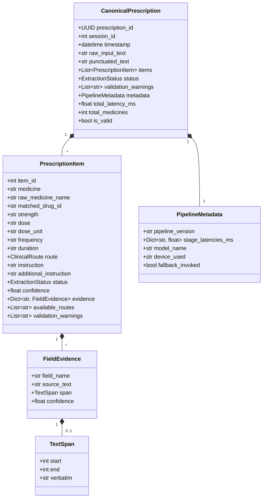
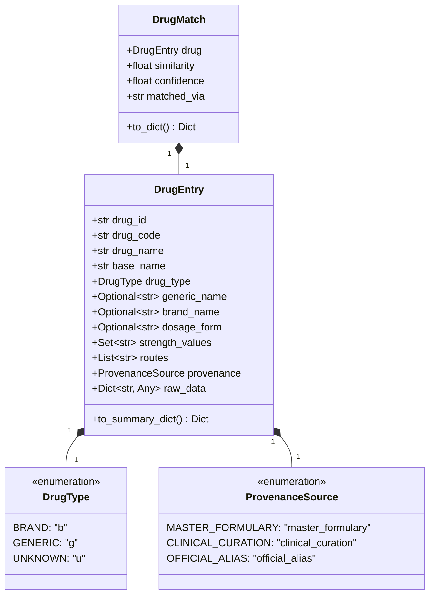

# Canonical Data Model Specification: Agentic Prescription Generator

**Version**: 1.0.0  
**Date**: September 8, 2026  
**Implementation**: [`app/prescription/schema.py`](file:///c:/Users/ADMIN/Downloads/rx_extractor_app_agentic/app/prescription/schema.py)  
**Status**: Canonical Standard  

---

## 1. Core Principles

1. **One Canonical Prescription Schema**: All subsystems (deterministic regex, LangGraph agents, API gateway, exporters, databases) communicate strictly via this schema.
2. **Strict Nullability & Zero Fabrication**: Missing clinical fields are strictly `null` (Python `None`) or `unknown` (for enums). The system **never fabricates** clinical doses, routes, or instructions, and never uses fake string placeholders like `"NONE"` or `"N/A"`.
3. **Traceable Provenance & Evidence**: Every extracted clinical field must be traceable back to verbatim source text tokens whenever possible.
4. **Explicit Lifecycle States**: Every line item and extraction job has an explicit status tracking progression through extraction, reconciliation, and validation.

---

## 2. Canonical Prescription Schema



---

## 3. Field Definitions & Nullability Rules

| Field | Type | Nullable? | Description | Example |
| :--- | :--- | :---: | :--- | :--- |
| `item_id` | `int` | No | 1-indexed sequence identifier. | `1` |
| `medicine` | `str` | No | Canonical brand or generic medication name. | `"Paracetamol 650 mg"` |
| `raw_medicine_name` | `str` | **Yes** | Verbatim raw name spoken by the doctor. | `"parasitamol"` |
| `matched_drug_id` | `str` | **Yes** | Unique formulary ID from `DrugRepository`. | `"16176"` |
| `strength` | `str` | **Yes** | Active formulation strength. | `"650 mg"` |
| `dose` | `str` | **Yes** | Quantity or active dose value. | `"650"` |
| `dose_unit` | `str` | **Yes** | Measurement unit (mg, ml, puffs). | `"mg"` |
| `frequency` | `str` | **Yes** | Administration frequency or timing notation. | `"twice daily (1-0-1)"` |
| `duration` | `str` | **Yes** | Prescription span or course. | `"5 days"` |
| `route` | `ClinicalRoute` | No (Enum) | Anatomical route (defaults to `unknown`). | `ClinicalRoute.ORAL` |
| `instruction` | `str` | **Yes** | Primary meal rules, ingestion instructions. | `"after meals"` |
| `additional_instruction`| `str` | **Yes** | Titrations, warnings, contingency advice. | `"if fever persists, consult doctor"` |
| `confidence` | `float` | No | Bounded confidence score $\in [0.0, 1.0]$. | `0.98` |
| `status` | `ExtractionStatus`| No (Enum) | Current lifecycle status. | `ExtractionStatus.VALIDATED`|
| `evidence` | `Dict[str, FieldEvidence]`| No | Map of field names to evidence tokens. | See Section 4 |

> [!IMPORTANT]
> Any input containing empty strings, whitespace, `"NONE"`, `"null"`, `"UNKNOWN"`, or `"N/A"` for clinical fields (e.g. `strength`, `frequency`, `duration`, `instruction`) is automatically coerced to Python `None` (JSON `null`) during model validation.

---

## 4. Evidence & Provenance Model

Every extracted clinical entity links back to the source text via `FieldEvidence`.

### Schema
```json
{
  "field_name": "medicine",
  "source_text": "Take one tablet of Paracetamol 650 mg",
  "span": {
    "start": 19,
    "end": 37,
    "verbatim": "Paracetamol 650 mg"
  },
  "confidence": 0.99
}
```

### JSON Prescription Item with Traceability
```json
{
  "item_id": 1,
  "medicine": "Metformin 500 mg",
  "raw_medicine_name": "metaformin",
  "matched_drug_id": "4051",
  "strength": "500 mg",
  "dose": "500",
  "dose_unit": "mg",
  "frequency": "twice daily",
  "duration": "30 days",
  "route": "oral",
  "instruction": "strictly with meals",
  "additional_instruction": null,
  "status": "VALIDATED",
  "confidence": 0.96,
  "evidence": {
    "medicine": {
      "field_name": "medicine",
      "source_text": "metaformin 500 mg",
      "span": {
        "start": 5,
        "end": 22,
        "verbatim": "metaformin 500 mg"
      },
      "confidence": 0.98
    },
    "frequency": {
      "field_name": "frequency",
      "source_text": "take twice daily",
      "span": {
        "start": 23,
        "end": 39,
        "verbatim": "take twice daily"
      },
      "confidence": 0.95
    },
    "instruction": {
      "field_name": "instruction",
      "source_text": "strictly with meals to avoid stomach upset",
      "span": {
        "start": 40,
        "end": 82,
        "verbatim": "strictly with meals to avoid stomach upset"
      },
      "confidence": 0.94
    }
  },
  "available_routes": ["ORAL"],
  "validation_warnings": []
}
```

---

## 5. Status Lifecycle Model

The lifecycle status transitions cleanly across stages:

```text
       [ Raw Input ]
             │
             ▼
        NORMALIZED  ──────────────► (Punctuation & Phonetics normalized)
             │
             ▼
         EXTRACTED  ──────────────► (Parsed by Deterministic or LLM engine)
             │
    ┌────────┴────────┐
    ▼                 ▼
[ Consensus ]    [ Contradiction ]
    │                 │
    │                 ▼
    │              CONFLICT  ─────► (Deterministic & LLM disagree)
    │                 │
    ▼                 ▼
  VALIDATED     NEEDS_REVIEW ─────► (Low grounding or ungrounded entity)
                      │
                      ▼
                    ERROR   ──────► (Critical validation violation)
```

| Status Code | Description | Next Action |
| :--- | :--- | :--- |
| `UNKNOWN` | Uninitialized or indeterminate state. | Flag for pipeline initialization. |
| `NORMALIZED` | Transcript has been punctuated and phonetically cleaned. | Proceed to segmentation. |
| `EXTRACTED` | Raw entities parsed from text. | Forward to reconciler. |
| `VALIDATED` | Verified against `DrugRepository`, grounded, anti-hallucination checks passed. | Deliver to API / UI / Exporter. |
| `CONFLICT` | Deterministic and LLM extractions diverge on a core field. | Trigger supervisor resolution or human review. |
| `NEEDS_REVIEW` | Entity partially matched or dosage unit ambiguous. | Highlight in UI with yellow review tag. |
| `ERROR` | Critical validation failure (e.g. ungrounded entity, corrupted dosage). | Reject item or request re-dictation. |

---

## 6. Typed Intermediate Pipeline Models

To eliminate ad-hoc untyped dictionaries between stages, the pipeline defines four explicit intermediate schemas:

### 1. `DeterministicExtractionCandidate`
Emitted by Stage 3 (Deterministic Extractor):
```python
class DeterministicExtractionCandidate(BaseModel):
    raw_clause: str
    medicine_candidates: List[str]
    matched_drug_id: Optional[str] = None
    formulation_strength: Optional[str] = None
    order_strength: Optional[str] = None
    frequency: Optional[str] = None
    duration: Optional[str] = None
    route: ClinicalRoute = ClinicalRoute.UNKNOWN
    instruction: Optional[str] = None
    additional_instruction: Optional[str] = None
    confidence: float = Field(default=1.0, ge=0.0, le=1.0)
    matched_by_soundex: bool = False
    evidence_tokens: Dict[str, str] = Field(default_factory=dict)
```

### 2. `LLMExtractionCandidate`
Emitted by Stage 4 (LangGraph Multi-Agent Orchestrator):
```python
class LLMExtractionCandidate(BaseModel):
    medicine_id: int
    drug_name: str
    strength: Optional[str] = None
    route: Optional[str] = None
    frequency: Optional[str] = None
    duration: Optional[str] = None
    instruction: Optional[str] = None
    additional_instruction: Optional[str] = None
    raw_agent_responses: Dict[str, Any] = Field(default_factory=dict)
    confidence: float = Field(default=0.9, ge=0.0, le=1.0)
```

### 3. `ReconciliationItem` & `ReconciledField`
Emitted by Stage 5 (Reconciler):
```python
class ReconciledField(BaseModel):
    field_name: str
    selected_value: Optional[str] = None
    source_stage: ExtractionStage
    deterministic_value: Optional[str] = None
    llm_value: Optional[str] = None
    has_conflict: bool = False
    evidence: Optional[FieldEvidence] = None

class ReconciliationItem(BaseModel):
    item_id: int
    medicine: str
    fields: Dict[str, ReconciledField] = Field(default_factory=dict)
    overall_status: ExtractionStatus = ExtractionStatus.NORMALIZED
    has_conflict: bool = False
    conflict_details: List[str] = Field(default_factory=list)
```

### 4. `ValidationResult` & `ValidationFinding`
Emitted by Stage 6 (Validator Boundary):
```python
class ValidationFinding(BaseModel):
    item_id: Optional[int] = None
    field_name: Optional[str] = None
    severity: ValidationSeverity  # INFO | WARNING | ERROR
    rule_id: str
    message: str
    rejected_value: Optional[Any] = None

class ValidationResult(BaseModel):
    status: ExtractionStatus
    is_valid: bool
    findings: List[ValidationFinding] = Field(default_factory=list)
    grounding_score: float = Field(default=1.0, ge=0.0, le=1.0)
    sanitized_items: List[PrescriptionItem] = Field(default_factory=list)
    requires_agent_feedback: bool = False
    targeted_feedback: Dict[str, str] = Field(default_factory=dict)
```

---

## 7. Canonical Drug Data Model

**Implementation**: [`app/drugs/schemas.py`](file:///c:/Users/ADMIN/Downloads/rx_extractor_app_agentic/app/drugs/schemas.py)  

To provide a single authoritative formulary interface, the repository defines typed drug models:

### Class Diagram



---

## 8. Brand / Generic Relational Model

Medications in the formulary are classified into:
1. **Brand Formulations (`drug_type = 'b'`)**: Proprietary commercial trade names (e.g. `DOLO 650 TAB`, `CROCIN 650 TAB`, `ATEN TAB 50MG`).
2. **Generic Substances (`drug_type = 'g'`)**: Active chemical entities and standard pharmacopeial formulations (e.g. `paracetamol(500 mg)Tablet`, `atenolol(50 mg)Tablet`, `spironolactone(25 mg)Tablet`).

### Relational Resolution
- Every brand formulation is linked to its active generic substance (e.g. `DOLO` → `PARACETAMOL`, `PAN` → `PANTOPRAZOLE`, `AUGMENTIN` → `AMOXICILLIN + CLAVULANIC ACID`).
- Searching by generic name (`find_by_generic("Paracetamol")`) queries both generic substance records and all associated commercial brand products.
- Searching by brand name (`find_by_brand("Dolo")`) queries commercial brand entries and their dosage formulations.

---

## 9. Data Provenance & Conflict Resolution Policy

### Authoritative Data Sources
| Priority | Source Layer | File / Symbol | Role | Provenance Tag |
| :---: | :--- | :--- | :--- | :--- |
| **1** | **Clinical Curation** | `WELL_KNOWN_CLINICAL_DRUGS` | Explicitly verified formulations (e.g. `Dolo-650`, `Crocin-650`, `Pan-40`, `Oxymetazoline 0.05%`) | `CLINICAL_CURATION` |
| **2** | **Master Dataset** | `Drug_database/drugList.json` & `Drug_Route_mapping.csv` | Master hospital formulary (14,353 records, 38,622 route mappings) | `MASTER_FORMULARY` |
| **3** | **Official Aliases** | `COMMON_DRUG_ALIASES` | Standard INN/British vs US spelling variants (`Amoxycillin` ↔ `Amoxicillin`, `Acetaminophen` ↔ `Paracetamol`) | `OFFICIAL_ALIAS` |

### Conflict Resolution Rules
1. **Zero Silent Mutation**: Clinical drug records are never silently modified or overwritten.
2. **Precedence Hierarchy**: If a drug entry exists in both the Master Dataset and Clinical Curation, the clinically curated entry takes precedence for route mappings and formulation strength bindings, while the original record's `raw_data` is preserved in `DrugEntry.raw_data`.
3. **Traceable Provenance**: Every `DrugEntry` exposes an explicit `provenance` field indicating its authoritative origin.
4. **Zero Hallucination Rule**: Queries for unrecognized medications (`find_exact()`, `find_normalized()`, `find_fuzzy()`) strictly yield `None` or empty candidate lists. Clinical values are never synthesized.

---

## 10. Drug Repository Interface Specification

**Implementation**: [`app/drugs/repository.py`](file:///c:/Users/ADMIN/Downloads/rx_extractor_app_agentic/app/drugs/repository.py)  

```python
class DrugRepository:
    def find_exact(self, name: str) -> Optional[DrugEntry]:
        """Case-sensitive or exact code/name lookup. Returns None if not found."""

    def find_normalized(self, name: str) -> Optional[DrugEntry]:
        """Normalizes case, whitespace, strips formulation/dosage tokens, and checks aliases."""

    def find_fuzzy(self, name: str, min_confidence: float = 0.75, limit: int = 5) -> List[DrugMatch]:
        """Phonetic and distance search (Soundex + Levenshtein) for typos. Returns empty list if below threshold."""

    def find_by_brand(self, brand_name: str, limit: int = 10) -> List[DrugEntry]:
        """Searches proprietary commercial trade names."""

    def find_by_generic(self, generic_name: str, limit: int = 10) -> List[DrugEntry]:
        """Searches active chemical entities and returns generic + associated brand products."""

    def find_strength(self, drug_name_or_id: str, strength_query: Optional[str] = None) -> List[str]:
        """Returns or validates recognized formulation strengths for a medication."""

    def find_route(self, drug_name_or_id: str) -> List[str]:
        """Returns permissible anatomical routes from master route mappings."""
```

