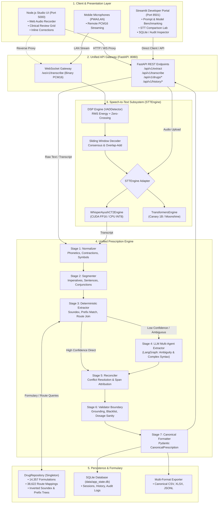

# Target Architecture Blueprint: Agentic Prescription Generator

**Version**: 3.0.0-Target  
**Date**: September 8, 2026  
**Status**: Architecture Design Blueprint (Pre-Implementation)  
**Author**: DeepMind Advanced Agentic Coding Pair  

---

## 1. Executive Summary & Core Architectural Principles

The forensic audit ([`docs/ARCHITECTURE_AUDIT.md`](file:///c:/Users/ADMIN/Downloads/rx_extractor_app_agentic/docs/ARCHITECTURE_AUDIT.md)) identified severe architectural fragmentation across the codebase: four competing extraction engines, triplicate phonetic normalizers, duplicate datasets, bypassed validation gates, and serial execution disguised as parallel agents.

This document establishes the **Target Architecture** for the rehabilitation. The foundational mandate is **ONE SYSTEM**:

1. **One Canonical Prescription Schema**: A single immutable, type-safe schema representing clinical prescriptions across all tiers.
2. **One Extraction Core**: A unified 7-stage pipeline replacing all procedural regex branches, in-memory Node engines, and browser-side extractors.
3. **One Drug Repository**: A single canonical Python-backed repository managing the master formulary and route relationships.
4. **One Validation Boundary**: Mandatory anti-hallucination, grounding, and clinical sanity validation on every extraction path without exception.
5. **One Canonical API**: FastAPI as the sole provider of clinical interpretation, ASR, and persistence.
6. **One Configuration & Telemetry Framework**: Centralized environment-driven configuration with structured logging and observable error boundaries.

---

## 2. Architecture Diagram



---

## 3. Target Directory & Folder Structure

All code is unified into a standard, clean Python package layout (`core/`) with presentation layers cleanly separated:

```text
Agentic_Prescription_Generator/
├── .env.example                                   # Canonical environment template
├── .gitignore                                     # Clean workspace rules
├── README.md                                      # Consolidated project documentation
├── pyproject.toml                                 # Unified project & toolchain metadata (PEP 621)
├── requirements.txt                               # Single canonical Python dependency manifest
├── start_all.bat / .sh                            # Portable environment-aware launchers
├── start_backend.bat / .sh                        # FastAPI launcher
├── start_frontend.bat / .sh                       # Node.js studio launcher
│
├── Drug_database/                                 # Canonical master dataset (typo fixed)
│   ├── drugList.json                              # 14,357 Master pharmaceutical formulations
│   ├── Drug_Route_mapping.csv                     # 38,622 Drug-to-route relational mappings
│   ├── drug_routes.csv                            # 49 Anatomical routes
│   ├── drug_schedule.csv                          # 39 Dosage frequency schedules
│   └── dose_units.csv                             # 31 Clinical measurement units
│
├── Whisper_Ayush_ct2/                             # Active CTranslate2 ASR model weights
│   ├── config.json
│   ├── model.bin                                  # 814 MB Quantized FP16/INT8 weights
│   ├── tokenizer.json
│   └── vocabulary.json
│
├── core/                                          # Unified Python Core Package
│   ├── __init__.py
│   ├── config.py                                  # Central Pydantic BaseSettings (.env driven)
│   ├── logging.py                                 # Structured logging configuration
│   │
│   ├── schemas/                                   # Canonical Pydantic v2 Models
│   │   ├── __init__.py
│   │   ├── prescription.py                        # PrescriptionItem & CanonicalPrescription
│   │   ├── drug.py                                # DrugEntry, RouteMapping, ScheduleEntry
│   │   └── telemetry.py                           # Audit logs, latency metrics, evidence spans
│   │
│   ├── drug_db/                                   # Single Canonical Drug Repository
│   │   ├── __init__.py
│   │   ├── repository.py                          # DrugRepository interface & implementation
│   │   ├── indexer.py                             # Soundex buckets & 3-char prefix indexer
│   │   └── matcher.py                             # Levenshtein distance & fuzzy candidate scoring
│   │
│   ├── stt/                                       # Modular Speech-to-Text Subsystem
│   │   ├── __init__.py
│   │   ├── base.py                                # Abstract STTEngine interface
│   │   ├── vad.py                                 # VADDetector (energy + zero crossing)
│   │   ├── stream_decoder.py                      # SlidingWindowStreamingDecoder
│   │   ├── adapters/
│   │   │   ├── __init__.py
│   │   │   ├── ct2_whisper.py                     # WhisperAyushCT2Engine adapter
│   │   │   └── transformers_stt.py                # Canary / Parakeet / Moonshine adapters
│   │   └── factory.py                             # Dynamic STT engine factory & registry
│   │
│   ├── prescription/                              # Unified 7-Stage Extraction Engine
│   │   ├── __init__.py
│   │   ├── normalizer.py                          # Stage 1: Phonetics, abbreviations, punctuation
│   │   ├── segmenter.py                           # Stage 2: Sentence & multi-clause segmenter
│   │   ├── deterministic.py                       # Stage 3: Sub-second regex & relational join
│   │   ├── agentic/                               # Stage 4: LangGraph Multi-Agent Orchestration
│   │   │   ├── __init__.py
│   │   │   ├── graph.py                           # StateGraph definition & invocation
│   │   │   ├── state.py                           # AgenticRxState TypedDict
│   │   │   ├── supervisor.py                      # Supervisor node
│   │   │   ├── medicine_agent.py                  # Drug & strength extractor
│   │   │   ├── route_agent.py                     # Route specificity extractor
│   │   │   ├── schedule_agent.py                  # Duration & frequency extractor
│   │   │   ├── instruction_agent.py               # Meal rules & contingency advice extractor
│   │   │   └── prompts.py                         # System prompt templates
│   │   ├── reconciler.py                          # Stage 5: Deterministic + LLM candidate merger
│   │   ├── validator.py                           # Stage 6: Grounding, dosage sanity & anti-hallucination
│   │   └── formatter.py                           # Stage 7: Canonical prescription generation
│   │
│   └── persistence/                               # Persistence & Exporters
│       ├── __init__.py
│       ├── db.py                                  # SQLite connection manager & queries
│       └── exporter.py                            # Pure CSV / Excel / JSONL serializers
│
├── api/                                           # Canonical FastAPI Backend Gateway
│   ├── __init__.py
│   ├── main.py                                    # FastAPI application factory & lifespan
│   ├── dependencies.py                            # Dependency injection (DrugRepo, STTEngine)
│   ├── routes/
│   │   ├── __init__.py
│   │   ├── extract.py                             # POST /api/v1/extract
│   │   ├── transcribe.py                          # POST /api/v1/transcribe & WS /ws/v1/transcribe
│   │   ├── drugs.py                               # GET /api/v1/drugs/search, did-you-mean, routes
│   │   └── history.py                             # GET/POST /api/v1/history, processes
│   └── websocket/
│       ├── __init__.py
│       └── stream_handler.py                      # Full-duplex binary audio socket handler
│
├── clients/                                       # Presentation Layer
│   ├── web_studio/                                # Node.js Express Client (Proxy & Static host)
│   │   ├── package.json
│   │   ├── server.js                              # Pure Express static server & reverse proxy
│   │   └── public/
│   │       ├── index.html                         # Glassmorphic UI
│   │       ├── app.js                             # Audio recording & table UI (no local extraction)
│   │       └── style.css
│   │
│   └── dev_portal/                                # Streamlit Developer & QA Dashboard
│       └── app.py                                 # Benchmark & model evaluation portal
│
├── tests/                                         # Unified Pytest Suite
│   ├── conftest.py                                # Test fixtures & synthetic test audio
│   ├── unit/
│   │   ├── test_normalizer.py
│   │   ├── test_segmenter.py
│   │   ├── test_deterministic.py
│   │   ├── test_validator.py
│   │   └── test_drug_repo.py
│   ├── integration/
│   │   ├── test_prescription_pipeline.py          # 22 Canonical regression tests (fixed)
│   │   ├── test_stt_engine.py                     # STTEngine & VAD verification
│   │   └── test_api_gateway.py                    # FastAPI endpoint tests via TestClient
│   └── benchmarks/
│       ├── test_stt_latency.py
│       └── test_pipeline_throughput.py
│
└── docs/                                          # Architecture & Audit Documentation
    ├── BASELINE.md
    ├── REHABILITATION_STATUS.md
    ├── ARCHITECTURE_AUDIT.md
    ├── TARGET_ARCHITECTURE.md
    └── MIGRATION_PLAN.md
```

---

## 4. Canonical Prescription Data Schema

The canonical schema is defined using **Pydantic v2** in [`core/schemas/prescription.py`](file:///c:/Users/ADMIN/Downloads/rx_extractor_app_agentic/core/schemas/prescription.py). All components must consume and produce instances of these models:

```python
from typing import List, Optional, Dict, Any
from enum import Enum
from pydantic import BaseModel, Field
import datetime


class RouteType(str, Enum):
    ORAL = "oral"
    INHALATION = "inhalation"
    TOPICAL = "topical"
    NASAL = "nasal"
    OPHTHALMIC = "ophthalmic"
    OTIC = "otic"
    RECTAL = "rectal"
    INTRAVENOUS = "intravenous"
    INTRAMUSCULAR = "intramuscular"
    SUBLINGUAL = "sublingual"
    NONE = "NONE"


class EvidenceSpan(BaseModel):
    field: str
    verbatim_text: str
    start_char: int
    end_char: int


class PrescriptionItem(BaseModel):
    item_id: int = Field(..., description="1-indexed sequence identifier")
    drug_name: str = Field(..., description="Canonical drug name including formulation dosage (e.g. Paracetamol 650 mg)")
    strength: str = Field(default="NONE", description="Secondary dose for combination drugs or NONE")
    frequency: str = Field(default="NONE", description="Schedule notation (e.g. twice daily(1-0-1))")
    duration: str = Field(default="NONE", description="Duration span (e.g. 5 days, 2 weeks)")
    route: RouteType = Field(default=RouteType.NONE, description="Anatomical route of administration")
    instruction: str = Field(default="NONE", description="Primary meal, device, or administration rule")
    additional_instruction: str = Field(default="NONE", description="Secondary clinical, dietary, or monitoring contingency advice")
    
    # Clinical UI helpers (derived automatically, not by heuristic post-mutators)
    dose: str = Field(default="NONE", description="Numeric dose value")
    dose_unit: str = Field(default="NONE", description="Clinical unit (mg, ml, etc.)")
    schedule: str = Field(default="NONE", description="Clinical schedule notation")
    days: str = Field(default="NONE", description="Total numeric days")
    
    # Validation & Evidence Metadata
    matched_drug_id: Optional[str] = Field(default=None, description="Formulary drug ID from DrugRepository")
    available_routes: List[str] = Field(default_factory=list, description="All permissible routes mapped to this formulation")
    confidence: float = Field(default=1.0, ge=0.0, le=1.0, description="Extraction confidence score")
    evidence_spans: List[EvidenceSpan] = Field(default_factory=list, description="Attributed source text tokens")


class ValidationStatus(str, Enum):
    VALID = "VALID"
    VALID_WITH_WARNINGS = "VALID_WITH_WARNINGS"
    REJECTED = "REJECTED"


class CanonicalPrescription(BaseModel):
    prescription_id: str = Field(..., description="Unique UUID for this prescription extraction")
    session_id: Optional[int] = Field(default=None, description="Associated database process/session ID")
    timestamp: datetime.datetime = Field(default_factory=datetime.datetime.utcnow)
    
    raw_input_text: str = Field(..., description="Verbatim doctor voice note or text")
    punctuated_text: str = Field(..., description="Punctuation-normalized text")
    
    items: List[PrescriptionItem] = Field(default_factory=list, description="Extracted prescription line items")
    
    validation_status: ValidationStatus = Field(default=ValidationStatus.VALID)
    validation_warnings: List[str] = Field(default_factory=list)
    
    extraction_mode: str = Field(default="deterministic", description="deterministic | agentic_llm | hybrid")
    latency_ms: float = Field(..., description="Total end-to-end extraction latency in milliseconds")
    model_used: Optional[str] = Field(default=None)
```

---

## 5. Unified 7-Stage Prescription Pipeline

The new extraction core decomposes interpretation into seven distinct, verifiable stages. Competing regex loops and client-side extraction are entirely abolished:

```text
Input Text ──► [1. Normalizer] ──► [2. Segmenter] ──► [3. Deterministic] ──┬─► (Low Confidence) ──► [4. LLM Agents] ──┐
                                                                           └─► (High Confidence) ───────────────────────┼──► [5. Reconciler] ──► [6. Validator] ──► [7. Formatter]
```

### Stage 1: Normalizer (`core/prescription/normalizer.py`)
- Standardizes ASR phonetic confusions (`"eight and 50"` -> `"Aten 50"`, `"Metaforamine"` -> `"Metformin"`).
- Normalizes punctuation, decimal formats (`0.5%`, `1.5 mg`), contractions, and clinical symbols (`1-0-1`, `TID`).
- Decouples conversational greetings and timestamp headers without dropping clinical content.

### Stage 2: Segmenter (`core/prescription/segmenter.py`)
- Identifies prescription boundaries, conjunction transitions (`"and take"`, `"also start"`, `"alongside"`), and clauses.
- Resolves speaker transitions and separates medication directives from patient vitals and symptoms.

### Stage 3: Deterministic Extractor (`core/prescription/deterministic_extractor.py`)
- High-speed procedural parsing (< 10ms execution budget).
- Queries `DrugRepository` for candidate base names, dosage strengths, and mapped routes.
- Resolves standard frequencies (`OD`, `BD`, `TID`, `1-0-1`) and primary instructions (`before breakfast`, `after meals`).
- Assigns a stage confidence score ($C \in [0.0, 1.0]$). If $C \ge 0.95$, the extraction can bypass LLM inference safely.

### Stage 4: LLM Multi-Agent Extractor (`core/prescription/agentic/`)
- Triggered when:
  1. The user explicitly selects an LLM in the client.
  2. Deterministic confidence is low ($C < 0.95$).
  3. Complex linguistic coreference is detected (e.g. *"Both should be taken twice daily after meals"*).
- Executes LangGraph `StateGraph` with targeted prompts for Supervisor, Medicine/Strength, Route, Schedule, and Instruction agents.

### Stage 5: Reconciler (`core/prescription/reconciler.py`)
- Harmonizes deterministic extraction records with LLM outputs.
- Attaches text evidence spans (`EvidenceSpan`) mapping each extracted drug, dose, and frequency to verbatim character positions in the raw text.
- Formulates a unified candidate list.

### Stage 6: Validator Boundary (`core/prescription/validator.py`)
- Strict, zero-hallucination verification gate:
  - **Grounding Check**: Verifies that every extracted drug name and numeric dose exists verbatim in the source input or maps through the verified phonetics table.
  - **Anti-Hallucination Guard**: Rejects moralizing disclaimers (`"please consult a doctor"`, `"remember to eat healthy"`).
  - **Blacklist Filter**: Rejects conversational entities, diagnostic reports, and non-drug terms.
  - **Route Sanity**: Cross-references selected route with `DrugRepository.get_routes_for_drug()`.
  - **Correction Feedback Loop**: If validation fails in Agentic mode, feeds targeted errors back to the LangGraph supervisor (up to 3 iterations).

### Stage 7: Canonical Formatter (`core/prescription/formatter.py`)
- Emits the type-safe `CanonicalPrescription` object.
- Persists process and history records to SQLite.
- Triggers CSV/Excel/JSONL serializers.

---

## 6. Speech-to-Text (STT) Subsystem Architecture

### Interface Definition (`core/stt/base.py`)
All STT models must implement a single abstract interface:

```python
from abc import ABC, abstractmethod
from typing import BinaryIO, Union, Generator, Dict, Any
import numpy as np


class STTEngine(ABC):
    @abstractmethod
    def load(self, device: str = "auto") -> None:
        """Loads and pre-warms model weights onto target device."""
        pass

    @abstractmethod
    def transcribe(
        self,
        audio_input: Union[bytes, str, BinaryIO, np.ndarray],
        language: str = "en",
        initial_prompt: Optional[str] = None,
    ) -> str:
        """Transcribes complete audio buffer or file safely."""
        pass

    @abstractmethod
    def transcribe_chunk(
        self,
        pcm_data: np.ndarray,
        sample_rate: int = 16000,
        initial_prompt: Optional[str] = None,
    ) -> Dict[str, Any]:
        """Low-latency transcription for streaming sliding-window decoding."""
        pass

    @abstractmethod
    def is_cuda_available(self) -> bool:
        """Returns whether this engine is running on hardware acceleration."""
        pass
```

### Adapters & Engine Registry
1. **`WhisperAyushCT2Engine`** (Default Production Engine):
   - Implements `STTEngine` using `faster_whisper` / `ctranslate2`.
   - Binds to `Whisper_Ayush_ct2/model.bin` on CUDA FP16 (with CPU INT8 fallback).
   - Eliminates hardcoded external Ollama DLL paths by dynamically loading PyTorch/CUDA libraries through platform-safe discovery.
   - Accepts `bytes`, file path strings, file-like objects, or `numpy.ndarray` without raising `TypeError`.
2. **`TransformersSTTEngine`**:
   - Implements `STTEngine` for Hugging Face models (`canary_1b`, `parakeet_tdt`, `moonshine`).
3. **Engine Factory (`core/stt/factory.py`)**:
   - Registry pattern allowing runtime switching between models via configuration string.

### Streaming Audio & VAD Integration
- Live streaming WebSockets consume raw PCM16 bytes directly from client mics.
- **`VADDetector`** filters background noise at `< 0.05ms` latency per 30ms frame.
- **`SlidingWindowStreamingDecoder`** accumulates active speech frames, invokes `STTEngine.transcribe_chunk()`, and applies prefix-consensus deduplication.

---

## 7. Drug Repository Architecture (`DrugRepository`)

### Design & Singleton Registry (`core/drug_db/repository.py`)
The fragmented data sources (Node in-memory tables, Python word sets, client-side browser JSON) are superseded by a single, canonical, high-speed Python `DrugRepository` singleton:

```python
class DrugRepository:
    """Canonical Master Formulary & Relational Route Repository."""
    
    def __init__(self, data_dir: Path):
        self.drugs_by_id: Dict[str, DrugEntry] = {}
        self.drugs_by_clean_name: Dict[str, List[DrugEntry]] = {}
        self.soundex_buckets: Dict[str, List[str]] = {}
        self.prefix_index: Dict[str, List[str]] = {}
        self.route_mappings: Dict[str, List[str]] = {}
        self.schedules: List[ScheduleEntry] = []
        self.dose_units: List[DoseUnitEntry] = []
        self._load_and_index(data_dir)

    def search(self, query: str, limit: int = 30) -> List[DrugEntry]:
        """Sub-millisecond Soundex + prefix candidate lookup."""
        pass

    def did_you_mean(self, term: str) -> Optional[str]:
        """O(1) Soundex bucket candidate search with Levenshtein ranking."""
        pass

    def get_routes_for_drug(self, drug_id: str, drug_type: Optional[str] = None) -> List[str]:
        """Relational route lookup from Drug_Route_mapping."""
        pass

    def get_strengths_for_base(self, base_name: str) -> Set[str]:
        """Returns all recognized formulation strength integers for a base medicine."""
        pass
```

### Formulary Dataset Consolidation
- The master directory is canonically renamed to **`Drug_database/`** (fixing the typo `Drug_databse`).
- **Eliminate Duplicate Folder**: Delete `rx_node_app/public/data/` (saves 3.15 MB of redundant disk space and eliminates cache drift).
- **Consolidate Common Clinical Brands**: Append common Indian clinical brands (`DOLO 650 TAB`, `DOLO 500 TAB`, `PAN 40 TAB`, `PAN-D CAP`, `TELMA 40 TAB`) directly into the master `drugList.json` file so all services share them.

---

## 8. Canonical API Architecture (FastAPI Gateway)

FastAPI running on port `8080` is the single source of truth for all API contracts.

### REST Endpoints
| HTTP Method | Route | Description | Request Body | Response Model |
| :--- | :--- | :--- | :--- | :--- |
| `GET` | `/api/v1/status` | System health, GPU status, active thread | None | `SystemStatusResponse` |
| `GET` | `/api/v1/models` | Available LLM and STT models | None | `ModelsCatalogResponse` |
| `POST` | `/api/v1/extract` | Unified prescription extraction | `ExtractRequest` | `CanonicalPrescription` |
| `POST` | `/api/v1/transcribe` | Audio file transcription | `multipart/form-data` (file, model) | `TranscriptionResponse` |
| `GET` | `/api/v1/drugs/search` | Search master formulary | `q: str, limit: int` | `DrugSearchResponse` |
| `GET` | `/api/v1/drugs/did-you-mean` | Phonetic fuzzy suggestion | `q: str` | `DidYouMeanResponse` |
| `GET` | `/api/v1/drugs/{id}/routes` | Permissible route lookups | Path parameter `id` | `DrugRoutesResponse` |
| `GET` | `/api/v1/history` | Historical queries by session | `session_id: Optional[int]` | `List[HistoryRecord]` |

### WebSocket Protocol (`/ws/v1/transcribe`)
- **Handshake**: Client connects and receives `{"type": "connected", "stt_model": "whisper_ayush", "sample_rate": 16000}`.
- **Audio Streaming**: Client streams binary PCM16 chunks (16kHz mono, 1024-4096 bytes per packet).
- **Partial Responses**: Server broadcasts `{"type": "partial", "text": "...", "duration": 1.5, "latency_ms": 18.2}`.
- **Control Messages**: Client sends JSON `{"action": "finalize"}` or `{"action": "reset"}`.
- **Final Result**: Server emits `{"type": "final", "raw_text": "...", "punctuated_text": "...", "final_latency_ms": 22.1}`.

---

## 9. Role Definition for Client Surfaces

### Surface 1: Node.js Web Studio (`clients/web_studio/`)
- **Defined Role**: **Primary Clinical Presentation & Audio Capture Layer**.
- **Refactoring Scope**:
  1. **Abolish In-Memory Extraction**: Remove `drugDbService.js` extraction engine and client-side `analyzePrescriptionText()` from `app.js`.
  2. **Abolish Local Data Storage**: Stop downloading 3.1 MB JSON/CSV datasets into browser RAM.
  3. **Thin Proxy Architecture**: Node Express server acts strictly as a static file server and reverse proxy, routing `/api/*` and `/ws/*` calls directly to FastAPI on port 8080.
  4. **Clinical UI Polish**: Retain the glassmorphic waveform visualizer, audio recorder, inline table editor, and CSV/Excel download actions.

### Surface 2: Streamlit Dashboard (`clients/dev_portal/`)
- **Defined Role**: **Developer, QA, & Benchmark Portal**.
- **Refactoring Scope**:
  1. Does not compete with the clinical web studio.
  2. Dedicated to model comparison (benchmarking Whisper Turbo vs Canary vs Moonshine on identical audio).
  3. Dedicated to prompt experimentation, LangGraph inspector, and gold-standard regression test execution.
  4. Directly imports the canonical `core` package without duplicating logic.

---

## 10. Unified Error Handling & Logging Strategy

### Error Taxonomy
All application exceptions inherit from a base domain exception in `core/errors.py`:

```python
class RxAgentException(Exception):
    """Base exception for all domain errors."""
    pass

class ModelInferenceError(RxAgentException):
    """Raised when an STT engine or LLM fails execution."""
    pass

class ValidationError(RxAgentException):
    """Raised when extracted prescriptions fail clinical safety or grounding checks."""
    pass

class FormularyLookupError(RxAgentException):
    """Raised when master drug database files are unreadable or missing."""
    pass
```

### Error Handling Rules
1. **No Silent Error Swallowing**: Any `except Exception: pass` is prohibited. If an LLM call fails, the exception must be logged at `WARNING` with telemetry before falling back to deterministic extraction.
2. **Graceful Degradation**: If hardware-accelerated STT (CUDA) fails, automatically fall back to CPU INT8 and log a structured alert.
3. **Structured Logging**: Configure Python `logging` with standard formatters and timestamps:
   `[%(asctime)s] [%(levelname)s] [%(name)s]: %(message)s`.

---

## 11. Centralized Configuration System

Replaces all fragmented globals and hardcoded variables with a single Pydantic `BaseSettings` object in `core/config.py`:

```python
from pathlib import Path
from pydantic_settings import BaseSettings, SettingsConfigDict


class AppConfig(BaseSettings):
    model_config = SettingsConfigDict(env_file=".env", env_file_encoding="utf-8", extra="ignore")

    # Host & Ports
    HOST: str = "127.0.0.1"
    PORT: int = 8080
    NODE_PORT: int = 5000
    STREAMLIT_PORT: int = 8501

    # Storage Paths
    BASE_DIR: Path = Path(__file__).resolve().parent.parent
    DATA_DIR: Path = BASE_DIR / "data"
    DRUG_DB_DIR: Path = BASE_DIR / "Drug_database"
    OUTPUT_DIR: Path = DATA_DIR / "outputs"
    AUDIO_DIR: Path = DATA_DIR / "audio_files"
    SQLITE_PATH: Path = DATA_DIR / "app_state.db"

    # STT Settings
    DEFAULT_STT_MODEL: str = "whisper_ayush"
    CT2_MODEL_PATH: Path = BASE_DIR / "Whisper_Ayush_ct2"
    STT_DEVICE: str = "auto"  # auto | cuda | cpu
    VAD_ENERGY_THRESHOLD: float = 0.01

    # LLM & Extraction Settings
    DEFAULT_LLM_MODEL: str = "Meta-Llama-3-8B-Instruct.Q4_0.gguf"
    ENABLE_AGENTIC_LLM: bool = False  # Deterministic by default (<15ms)
    MAX_VALIDATION_REPETITIONS: int = 3
```

---

## 12. Target Testing Architecture

The fragmented verification scripts are consolidated into a single standard **Pytest** test suite:

### Test Hierarchy (`tests/`)
1. **Unit Tests (`tests/unit/`)**:
   - `test_normalizer.py`: Tests phonetic replacement, punctuation normalization, and contraction fixes.
   - `test_segmenter.py`: Tests sentence splitting and transition word boundaries.
   - `test_deterministic.py`: Tests sub-second regex extraction and formulary matching.
   - `test_validator.py`: Tests anti-hallucination rejection, blacklist filtering, and grounding checks.
   - `test_drug_repo.py`: Tests Soundex bucket search, prefix indexing, and route joins.
2. **Integration Tests (`tests/integration/`)**:
   - `test_prescription_pipeline.py`: Replaces `test_langgraph_pipeline.py`. Contains all **22 clinical regression scenarios** running against the canonical 7-stage pipeline. Fixes the 5 regression failures identified in the baseline.
   - `test_api_gateway.py`: Tests all FastAPI REST endpoints and WebSocket protocols using `httpx` and `fastapi.testclient.TestClient`.
   - `test_stt_engine.py`: Tests `STTEngine` adapters, VAD accuracy, and sliding window consensus.
3. **Benchmarks (`tests/benchmarks/`)**:
   - `test_stt_latency.py`: Automated benchmarking of ASR inference times on CUDA vs CPU.
   - `test_pipeline_throughput.py`: Extraction throughput benchmarks ensuring `< 20ms` latency for deterministic paths.

---

## 13. Technical Debt Retirement Map

| Current Component | Issue / Technical Debt | Target Resolution |
| :--- | :--- | :--- |
| `rx_node_app/drugDbService.js` | 1,092 lines of duplicated extraction logic in Node.js | **Abolish extraction logic**: Retain only thin proxying to FastAPI. |
| `rx_node_app/public/app.js` | 1,876 lines of duplicated in-browser extraction and 3.1 MB data fetch | **Abolish client-side extraction**: Retain UI rendering and streaming audio logic. |
| `rx_node_app/public/data/*` | 3.15 MB exact duplicate copy of master dataset | **Delete entirely**: Save disk space and avoid formulary drift. |
| `Drug_databse/` | Typo in master directory name | **Rename canonically** to `Drug_database/`. |
| `Whisper_Ayush/.../merged_turbo_rx_v1` | Dead folder with no model weights | **Delete entirely**: Eliminate false checkpoint storage. |
| `rx_extractor_app/vectorstore.py` | FAISS vectorstore overhead for single static prompt string | **Deprecate**: Replace with direct in-memory prompt template loader. |
| `rx_extractor_app/pipeline.py` | Top-level `import streamlit as st` contaminating background tasks | **Refactor**: Remove Streamlit dependencies from core Python modules. |
| `transcriber.py:L285` | `TypeError` on string path arguments | **Fix**: Support string path, raw bytes, or file streams transparently. |
| `start_backend.bat` | Hardcoded `C:\Users\ADMIN\...` machine paths | **Refactor**: Replace with portable relative virtualenv launcher. |
| Multiple `except Exception: pass` | Silent error swallowing masking model failures | **Eliminate**: Replace with typed exceptions and structured logging. |
| 5 Failing Tests in LangGraph suite | Dosage regex and string assertion mismatches | **Resolve**: Align Stage 3 deterministic parser with formulation strengths in `drugList.json`. |
