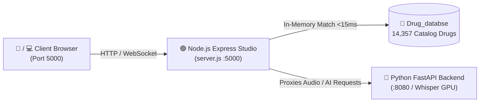

# 🚀 RxAgent Node.js Clinical Studio — Ubuntu Linux Setup & Execution Guide

This document provides complete, step-by-step instructions for deploying and running **`rx_node_app`** on any **Ubuntu / Debian Linux** system (desktop, cloud VPS, Raspberry Pi, or local server).

---

## 📋 Table of Contents
1. [System Architecture](#1-system-architecture)
2. [Prerequisites on Ubuntu Linux](#2-prerequisites-on-ubuntu-linux)
3. [Required Files & Directory Layout](#3-required-files--directory-layout)
4. [Step-by-Step Installation & Launch](#4-step-by-step-installation--launch)
5. [Connecting to the Python Backend](#5-connecting-to-the-python-backend)
6. [Running in Production on Linux (PM2 or Systemd)](#6-running-in-production-on-linux-pm2-or-systemd)
7. [Ubuntu Firewall Setup (UFW)](#7-ubuntu-firewall-setup-ufw)
8. [Testing & Verification](#8-testing--verification)
9. [Troubleshooting Common Linux Issues](#9-troubleshooting-common-linux-issues)

---

## 1. System Architecture

`rx_node_app` is an Express.js web server that powers:
- **Clinical Glassmorphic Web UI**: Real-time waveform audio capture, voice dictation, and inline table flowsheet editor.
- **In-Memory Sub-Second SQL Flowsheet Engine**: Loads 14,357 catalog drugs and 38,622 route mappings, matching spoken drugs in **< 15ms** using soundex and relational indexing.
- **REST & WebSocket Gateway**: Coordinates with the Python FastAPI backend (Whisper GPU ASR) while serving the web application on **Port 5000**.



---

## 2. Prerequisites on Ubuntu Linux

Ensure **Node.js (v18.x, v20.x, or v22.x LTS)** and **npm** are installed.

### Quick Node.js Installation (Ubuntu 20.04 / 22.04 / 24.04 LTS):
Run the following in your Ubuntu terminal:

```bash
# Update package lists
sudo apt update

# Install curl if not present
sudo apt install -y curl

# Install Node.js 20.x LTS via NodeSource
curl -fsSL https://deb.nodesource.com/setup_20.x | sudo -E bash -
sudo apt install -y nodejs

# Verify versions (Requires Node >= 18.0.0)
node -v
npm -v
```

---

## 3. Required Files & Directory Layout

To run `rx_node_app` autonomously on Ubuntu, transfer the following files and folders:

```text
/your-linux-path/
├── Drug_databse/                  <-- Drug catalog & route mapping CSVs
│   ├── drugList.json
│   ├── Drug_Route_mapping.csv
│   ├── dose_units.csv
│   ├── drug_routes.csv
│   └── drug_schedule.csv
└── rx_node_app/                   <-- The Node.js application directory
    ├── package.json
    ├── package-lock.json
    ├── server.js                  <-- Main Express server
    ├── drugDbService.js           <-- Sub-second SQL flowsheet engine
    └── public/                    <-- Frontend HTML/CSS/JS assets
        ├── index.html
        ├── style.css
        ├── app.js
        └── favicon.svg
```

> **💡 Note on `Drug_databse`:**  
> `drugDbService.js` automatically looks for `Drug_databse` in **both** the parent directory (`../Drug_databse`) and inside `rx_node_app` (`./Drug_databse`). Either placement works out-of-the-box.

---

## 4. Step-by-Step Installation & Launch

### Step 1: Navigate to the application folder
```bash
cd rx_node_app
```

### Step 2: Install Node.js dependencies
Install the required Express, CORS, and Multer libraries:
```bash
npm install
```
*(This creates the Linux-native `node_modules` folder).*

### Step 3: Start the server
Run the app using the npm start script:
```bash
npm start
```
Or run directly with Node:
```bash
node server.js
```

### Expected Output on Terminal:
```text
[DrugDbService] Compiling sub-second relational SQL indexes...
[DrugDbService] Indexed 14357 drugs (11499 base names, 2852 soundex buckets).
[DrugDbService] Indexed 38622 route mappings.
[DrugDbService] Sub-second SQL flowsheet engine initialized in 82ms.
=======================================================
🚀 Rx Extractor Node.js Web App running on http://localhost:5000
🔗 Connected Python API Gateway: http://127.0.0.1:8080
=======================================================
```

👉 Open your browser to: **`http://localhost:5000`** (or `http://<your-server-ip>:5000`).

---

## 5. Connecting to the Python Backend

`rx_node_app` proxies audio transcription and AI extraction to the Python FastAPI backend. You can customize the backend address and port using environment variables:

### Case A: Python backend is running on the **same Ubuntu machine**:
No extra configuration is needed. It defaults to:
```bash
npm start
# Uses default: PYTHON_API_BASE="http://127.0.0.1:8080" and PORT=5000
```

### Case B: Python backend is running on a **different machine / GPU server**:
If your Python backend with the NVIDIA GPU is on another machine (e.g. `192.168.1.50:8080`):
```bash
PYTHON_API_BASE="http://192.168.1.50:8080" PORT=5000 npm start
```

### Case C: Change the listening web port (e.g. to port 80 or 8000):
```bash
PORT=8000 npm start
```

---

## 6. Running in Production on Linux (PM2 or Systemd)

For production deployments on Ubuntu where the app must restart automatically after reboots or crashes:

### Option A: Using PM2 (Easiest Process Manager)
```bash
# Install PM2 globally
sudo npm install -g pm2

# Navigate to app directory
cd rx_node_app

# Start the application as a background daemon
pm2 start server.js --name "rx-studio"

# Save process list for automatic reboot startup
pm2 save
pm2 startup
```

Useful PM2 commands:
```bash
pm2 status          # View status & memory usage
pm2 logs rx-studio  # View live application logs
pm2 restart rx-studio
pm2 stop rx-studio
```

---

### Option B: Using native Linux `systemd` Service
Create a systemd unit file:
```bash
sudo nano /etc/systemd/system/rx-studio.service
```

Paste the following configuration (update `/path/to/` with your actual directory):
```ini
[Unit]
Description=RxAgent Node.js Clinical Studio
After=network.target

[Service]
Type=simple
User=ubuntu
WorkingDirectory=/path/to/rx_node_app
Environment=NODE_ENV=production
Environment=PORT=5000
Environment=PYTHON_API_BASE=http://127.0.0.1:8080
ExecStart=/usr/bin/node server.js
Restart=always
RestartSec=5

[Install]
WantedBy=multi-user.target
```

Enable and start the service:
```bash
sudo systemctl daemon-reload
sudo systemctl enable rx-studio
sudo systemctl start rx-studio
sudo systemctl status rx-studio
```

---

## 7. Ubuntu Firewall Setup (UFW)

If accessing the web studio from other computers, phones, or tablets on your network, allow port `5000` through Ubuntu's Uncomplicated Firewall (UFW):

```bash
sudo ufw allow 5000/tcp
sudo ufw status
```

---

## 8. Testing & Verification

Once the server is running, you can test it from your Ubuntu terminal:

### 1. Check Health Endpoint:
```bash
curl -s http://localhost:5000/api/health | jq .
```
**Response:**
```json
{
  "status": "healthy",
  "app": "Rx Extractor Parallel Node.js App",
  "timestamp": "2026-09-07T14:52:00.000Z"
}
```

### 2. Test Sub-Second SQL Flowsheet Engine:
```bash
curl -s -X POST http://localhost:5000/api/match-prescription \
  -H "Content-Type: application/json" \
  -d '{"text": "Take Paracetamol 500 mg 200 mg for 3 days"}' | jq .
```
**Response:**
```json
{
  "latency_ms": 0.42,
  "total": 1,
  "records": [
    {
      "Drug_name": "paracetamol (500 mg)Tablet",
      "dose": "200",
      "dose_unit": "mg",
      "days": "3 days",
      "route": "ORAL"
    }
  ]
}
```

---

## 9. Troubleshooting Common Linux Issues

### 🔴 Problem 1: `Error: Cannot find module 'express'`
- **Cause**: `npm install` was not executed on the Linux machine.
- **Fix**: Run `npm install` inside the `rx_node_app` directory.

---

### 🔴 Problem 2: `[DrugDbService] Error compiling drugList.json: ENOENT`
- **Cause**: The `Drug_databse` folder was not copied to the machine or is in an unexpected location.
- **Fix**: Ensure the `Drug_databse` directory is placed alongside `rx_node_app/` or directly inside `rx_node_app/`.

---

### 🔴 Problem 3: `Error: listen EADDRINUSE: address already in use :::5000`
- **Cause**: Another process is already running on port 5000.
- **Fix**: Find and kill the process holding port 5000:
  ```bash
  sudo lsof -i :5000
  # Kill using the PID shown:
  sudo kill -9 <PID>
  ```

---

### 🔴 Problem 4: Node.js version is too old (`v12.x` or `v14.x` from default Ubuntu apt)
- **Cause**: Ubuntu's default repository has an outdated Node.js package.
- **Fix**: Update to Node.js 20.x LTS using NodeSource:
  ```bash
  curl -fsSL https://deb.nodesource.com/setup_20.x | sudo -E bash -
  sudo apt install -y nodejs
  node -v
  ```
